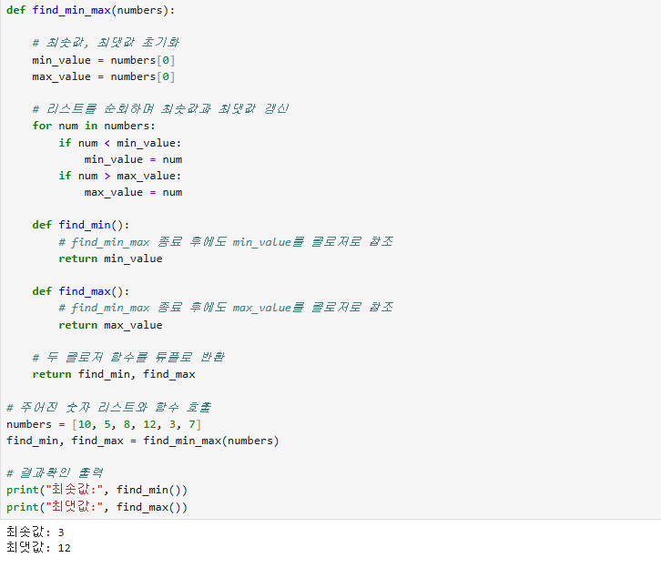
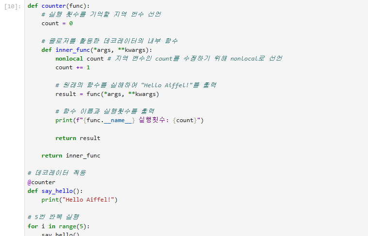

# AIFFEL Campus Online Code Peer Review Templete
- 코더 : 최승현
- 리뷰어 : 조연우


# PRT(Peer Review Template)
- [x]  **1. 주어진 문제를 해결하는 완성된 코드가 제출되었나요?**
    - 문제에서 요구하는 최종 결과물이 첨부되었는지 확인
        - 중요! 해당 조건을 만족하는 부분을 캡쳐해 근거로 첨부

  
주어진 문제를 모두 해결 하였고 출력도 확인 되었다
    
    
- [x]  **2. 전체 코드에서 가장 핵심적이거나 가장 복잡하고 이해하기 어려운 부분에 작성된 
주석 또는 doc string을 보고 해당 코드가 잘 이해되었나요?**

       - 중요! 잘 작성되었다고 생각되는 부분을 캡쳐해 근거로 첨부


        
- [ ]  **3. 에러가 난 부분을 디버깅하여 문제를 해결한 기록을 남겼거나
새로운 시도 또는 추가 실험을 수행해봤나요?**
    -없음
        
- [ ]  **4. 회고를 잘 작성했나요?**
    - 없음
        
- [x]  **5. 코드가 간결하고 효율적인가요?**
    - 문제 해결을 위해 배운 내용을 잘 적용하고 효과적이게 코드를 완성하였다


# 회고(참고 링크 및 코드 개선)
```
# 리뷰어의 회고를 작성합니다.

리뷰하는 과정에서 최승현님의 코드를 보고 난 후 문제를 푸는 이해도가 조금 올라가는 시간이 되었다.