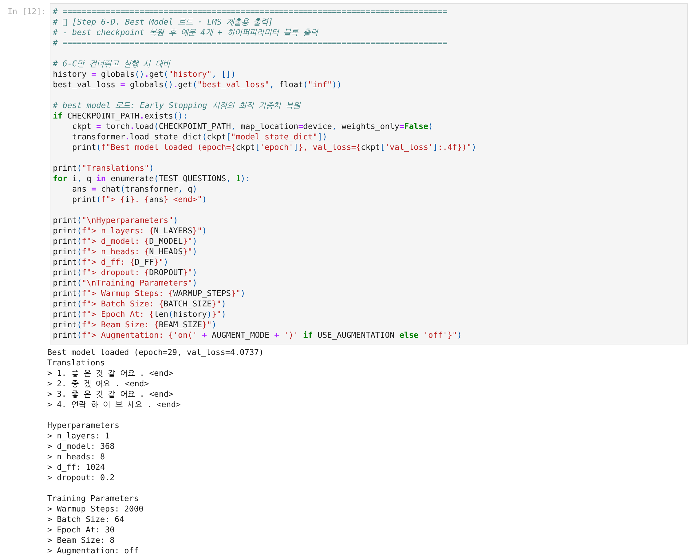
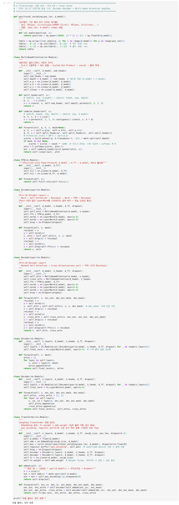
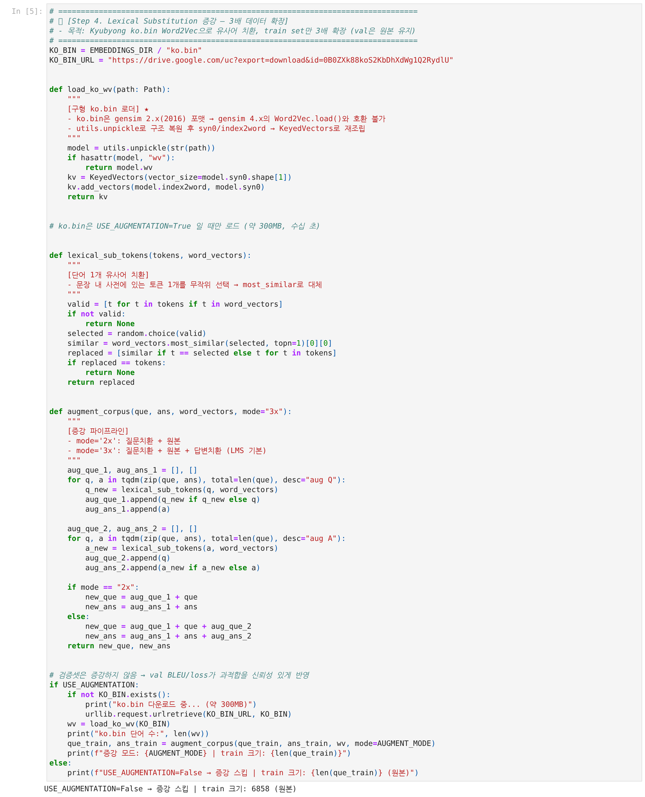
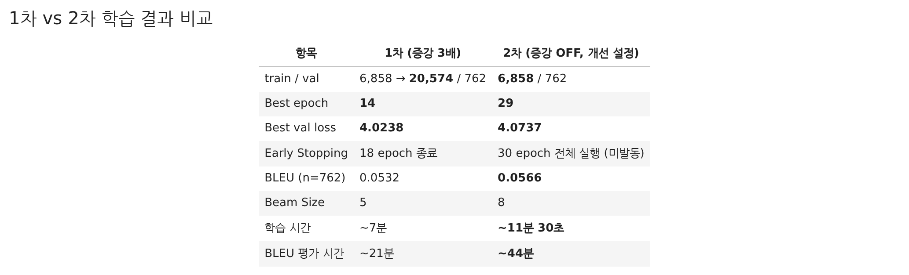
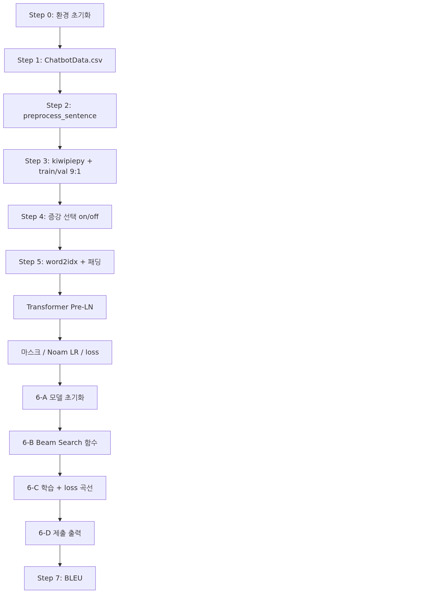
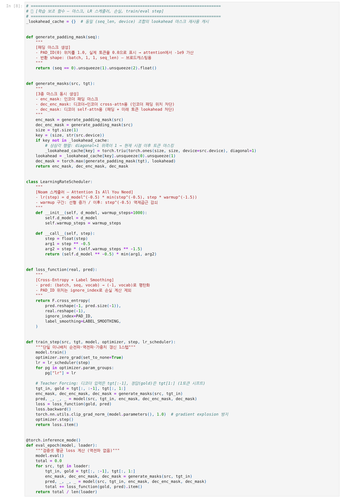
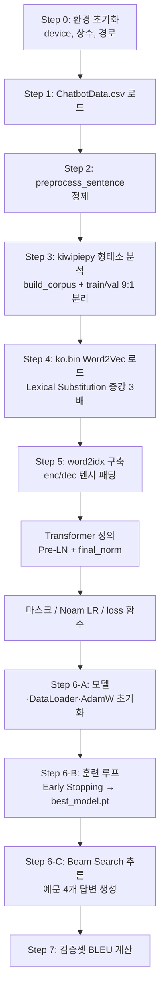

# AIFFEL Campus Online Code Peer Review Templete
- 코더 : 최승현
- 리뷰어 : 채진현


# PRT(Peer Review Template)
- [x]  **1. 주어진 문제를 해결하는 완성된 코드가 제출되었나요?**
    - 문제에서 요구하는 최종 결과물이 첨부되었는지 확인
        - 중요! 해당 조건을 만족하는 부분을 캡쳐해 근거로 첨부

    

- [x]  **2. 전체 코드에서 가장 핵심적이거나 가장 복잡하고 이해하기 어려운 부분에 작성된 
주석 또는 doc string을 보고 해당 코드가 잘 이해되었나요?**
    - 해당 코드 블럭을 왜 핵심적이라고 생각하는지 확인
    - 해당 코드 블럭에 doc string/annotation이 달려 있는지 확인
    - 해당 코드의 기능, 존재 이유, 작동 원리 등을 기술했는지 확인
    - 주석을 보고 코드 이해가 잘 되었는지 확인
        - 중요! 잘 작성되었다고 생각되는 부분을 캡쳐해 근거로 첨부

    Transformer 모델 정의(Pre-LN + Weight Tying) 부분이 가장 복잡한 코드 블록인데, 클래스·메서드마다 목적과 shape 변환을 설명하는 docstring/주석이 달려 있어 이해에 도움이 되었습니다.

    

- [x]  **3. 에러가 난 부분을 디버깅하여 문제를 해결한 기록을 남겼거나
새로운 시도 또는 추가 실험을 수행해봤나요?**
    - 문제 원인 및 해결 과정을 잘 기록하였는지 확인
    - 프로젝트 평가 기준에 더해 추가적으로 수행한 나만의 시도, 
    실험이 기록되어 있는지 확인
        - 중요! 잘 작성되었다고 생각되는 부분을 캡쳐해 근거로 첨부

    `ko.bin`이 gensim 2.x(2016) 포맷이라 gensim 4.x `Word2Vec.load()`와 호환되지 않는 문제를 `load_ko_wv()` 함수 docstring(★ 표시)에 원인·해결 방법을 기록했습니다. 또한 증강 3배(1차) vs 증강 OFF·하이퍼파라미터 조정(2차)을 비교하는 추가 실험을 수행하고 결과를 표로 남겼습니다.

    
    

- [x]  **4. 회고를 잘 작성했나요?**
    - 주어진 문제를 해결하는 완성된 코드 내지 프로젝트 결과물에 대해
    배운점과 아쉬운점, 느낀점 등이 기록되어 있는지 확인
    - 전체 코드 실행 플로우를 그래프로 그려서 이해를 돕고 있는지 확인
        - 중요! 잘 작성되었다고 생각되는 부분을 캡쳐해 근거로 첨부

    노트북 내 회고(배운 점/아쉬운 점/느낀 점)와 mermaid 플로우차트가 모두 작성되어 있습니다.

    

    > ⚠️ **불일치 확인**: 이 README 상단의 회고(`val loss 4.0238`, `BLEU 0.0532`)는 1차(증강 3배) 결과만 반영되어 있는데, 노트북(`NLP02.ipynb`) 내 회고와 Step 6-D/7 실제 출력은 2차(증강 OFF, epoch 30) 결과인 `val loss 4.0737`, `BLEU 0.0566`, `best epoch 29`를 최종값으로 사용하고 있습니다. README를 노트북의 최신(2차) 결과 기준으로 업데이트하는 것을 권장합니다.

- [x]  **5. 코드가 간결하고 효율적인가요?**
    - 파이썬 스타일 가이드 (PEP8) 를 준수하였는지 확인
    - 코드 중복을 최소화하고 범용적으로 사용할 수 있도록 함수화/모듈화했는지 확인
        - 중요! 잘 작성되었다고 생각되는 부분을 캡쳐해 근거로 첨부

    마스크 생성/LR 스케줄러/loss/train·eval step이 각각 함수·클래스로 모듈화되어 있어 재사용성이 높고, PEP8 네이밍(스네이크 케이스, 상수 대문자)을 준수하고 있습니다.

    


# 회고

## 프로젝트 요약

Ch.17~18 LMS에서 학습한 **Encoder-Decoder Transformer**를 그대로 활용해, 한국어 질문→답변 챗봇을 구현했습니다.  
`ChatbotData.csv` 약 1.2만 쌍을 전처리·증강한 뒤 학습했고, **Early Stopping(epoch 14 best, 18에서 종료)** 기준 **val loss 4.0238**, **BLEU 0.0532**를 기록했습니다.

---

## 전체 코드 실행 플로우



---

## 배운 점

1. **번역기와 챗봇의 공통점·차이점**  
   둘 다 Seq2Seq Transformer이지만, 챗봇은 소스·타겟이 **같은 언어(한국어)**라 Embedding을 공유(`fc.weight = emb.weight`)할 수 있고, 데이터 규모가 훨씬 작아 **과적합 방지**가 핵심 과제임을 체감했습니다.

2. **소규모 데이터에서의 정규화 전략**  
   train/val 분리(10%), train만 3배 증강, dropout(0.2), label smoothing(0.1), AdamW weight decay, Early Stopping을 함께 쓰면 train loss는 계속 내려가도 **val loss 기준 최적 시점**을 잡을 수 있다는 것을 확인했습니다. (epoch 14에서 val loss 최저, 이후 patience 4로 18 epoch에서 종료)

3. **추론 품질과 학습 손실은 별개**  
   val loss가 안정화되어도 예문 답변이 항상 자연스럽지는 않았습니다. **Beam Search(beam=5) + length penalty**가 greedy보다 나은 경우가 있지만, BLEU(0.0532)만으로 대화 품질을 충분히 설명하기는 어렵다는 점을 배웠습니다.

4. **환경 이슈 대응**  
   Mac에서는 MeCab 대신 **kiwipiepy**로 형태소 분석을 대체했고, 2016년 `ko.bin`은 gensim 4.x와 호환되지 않아 `utils.unpickle` → `KeyedVectors` 재조립 방식으로 로드해야 했습니다. 실무에서도 **라이브러리 버전·구형 모델 포맷**을 먼저 확인해야 함을 느꼈습니다.

---

## 아쉬운 점

1. **예문 4개 답변 품질**  
   LMS 예시 제출 답변(「잠깐 쉬어도 돼요」 등)에 비해, 현재 결과(「같이 가세요」, 「후회할 거예요」 등)는 질문 의도와 맞지 않는 경우가 있어 **하이퍼파라미터·epoch만으로는 한계**가 있음을 느꼈습니다.

2. **BLEU 점수**  
   검증셋 BLEU 0.0532는 형태소 단위 평가 특성상 낮게 나오기 쉬우며, 의미적으로 맞는 답이라도 표현이 다르면 점수가 잘 오르지 않습니다. **사람이 읽는 품질**과 수치 평가의 괴리가 컸습니다.

3. **BLEU 평가 시간**  
   Beam Search를 검증셋 762건 전체에 적용하니 약 21분이 소요되었습니다. 추론 배치화나 greedy 옵션 분리 등 **평가 파이프라인 최적화** 여지가 있습니다.

4. **증강 방식**  
   Word2Vec `most_similar` 1단어 치환만 사용했습니다. 문맥을 고려하지 않아 부자연스러운 쌍이 섞일 수 있어, **역번역·back-translation** 등 다른 증강도 시도해 볼 만합니다.

---

## 느낀 점

Ch.17 스페인어→영어 번역기를 만들 때는 데이터가 커서 “학습이 잘 되는지”에 집중했다면, 이번 챗봇 프로젝트에서는 **데이터가 작을 때 모델이 외우지 않게 하는 설계**가 더 중요하다는 것을 다시 깨달았습니다. epoch를 무작정 늘리는 것보다 **val 기준 best model 저장**이 실제 제출 품질에 더 직결됩니다.

또한 LMS 노트북을 Mac(MPS) 환경에 맞게 수정하고, 제출용 `NLP02.ipynb`로 정리하는 과정에서 **학습 코드 → 재현 가능한 파이프라인**으로 옮기는 작업 자체가 큰 학습이었습니다.

---

## 참고 링크

| 링크 | 설명 |
|------|------|
| [songys/Chatbot_data](https://github.com/songys/Chatbot_data) | 한국어 챗봇 Q&A 원본 데이터 |
| [Kyubyong/wordvectors (ko.bin)](https://github.com/Kyubyong/wordvectors) | 증강용 한국어 Word2Vec 사전 |
| [kiwipiepy](https://github.com/bab2min/kiwipiepy) | Mac 호환 한국어 형태소 분석 (MeCab 대체) |
| [Attention Is All You Need](https://arxiv.org/abs/1706.03762) | Transformer·Noam LR 스케줄러 원 논문 |

---

## 디버깅·개선 기록 (참고)

**문제:** Step 4에서 `Word2Vec.load(ko.bin)` 실행 시 `AttributeError: 'Word2Vec' object has no attribute 'wv'`  
**원인:** `ko.bin`이 gensim 2.x(2016) 포맷인데, 환경은 gensim 4.3.3  
**해결:** `gensim.utils.unpickle`로 구형 모델을 읽은 뒤 `syn0` + `index2word`를 `KeyedVectors`로 재조립

```python
def load_ko_wv(path):
    model = utils.unpickle(str(path))
    if hasattr(model, "wv"):
        return model.wv
    kv = KeyedVectors(vector_size=model.syn0.shape[1])
    kv.add_vectors(model.index2word, model.syn0)
    return kv
```