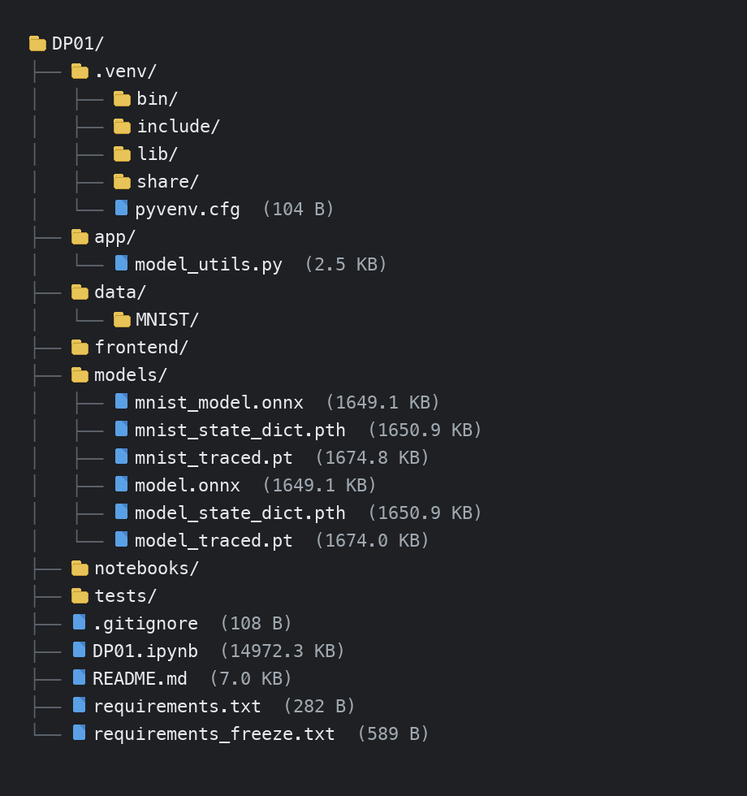

# DP01 제출 — RESTful API & 모델 직렬화

- 코더: 최승현
- 과정: AIFFEL Quest ENG / 06_Deployment / DP01

다음 내역을 기록하고 GitHub에 업로드하여 링크로 제출합니다.

---

## 1. 5-7 수행 내역 캡쳐

노트북 5–7 실습(프로젝트 폴더 구조 세팅) 실행 결과입니다.  
가상환경 폴더는 로컬에서 `.venv`로 생성했습니다.

### 수행 확인 포인트

| 항목 | 결과 |
|------|------|
| 가상환경 | `.venv` 생성 완료 (`bin`, `include`, `lib`, `pyvenv.cfg`) |
| 폴더 구조 | `models/`, `app/`, `frontend/`, `notebooks/`, `data/`, `tests/` 생성 |
| 의존성 | `requirements.txt` 작성, `requirements_freeze.txt` 생성 |
| 모델 저장 | MNIST를 **state_dict / TorchScript / ONNX** 3가지로 저장 |
| 추론 모듈 | `app/model_utils.py`에 `load_model()`, `predict()` 분리 |

---

## 2. 각 섹션의 체크포인트 답변

### 섹션 1. 들어가며

**1. `.pth` 파일만 전달했을 때, 상대방이 모델을 바로 사용할 수 없는 이유는 무엇입니까?**

`.pth`(특히 `state_dict`)는 가중치만 담고 있습니다. 모델 클래스 코드, Python/PyTorch 버전, 전처리, 의존성 패키지가 없으면 파일을 불러오거나 같은 결과를 낼 수 없습니다.

**2. 모델 학습(Training)과 모델 배포(Serving)의 핵심 차이를 한 문장으로 설명하세요.**

학습은 데이터로 파라미터를 최적화하는 과정이고, 배포는 학습된 모델을 다른 환경에서도 동일하게 실행되도록 환경·API·직렬화를 통제하는 과정입니다.

**3. 모델 배포에서 사용자와 서버가 소통하는 방식은 무엇입니까?**

HTTP 기반 RESTful API입니다. 클라이언트가 JSON으로 요청을 보내고, 서버가 추론 결과를 JSON으로 응답합니다.

---

### 섹션 2. 환경 세팅

**1. 가상환경 없이 `pip install`을 하면 패키지가 어디에 설치됩니까? 그것이 왜 문제가 될 수 있습니까?**

전역(시스템) Python site-packages에 설치됩니다. 프로젝트마다 필요한 버전이 다른데 한 공간을 공유하면 충돌이 나고, "내 컴퓨터에서는 되는데" 문제가 발생합니다.

**2. `pip freeze`로 생성한 파일과 직접 작성한 `requirements.txt`의 차이는 무엇입니까?**

직접 작성한 `requirements.txt`는 핵심 패키지만 사람이 관리하는 목록입니다. `pip freeze`는 하위 의존성까지 버전을 전부 고정해, 환경을 정밀하게 재현할 때 씁니다.

**3. 동료에게 프로젝트를 전달할 때, `.venv` 폴더 대신 무엇을 공유해야 합니까?**

`requirements.txt`(필요하면 `requirements_freeze.txt`)와 소스 코드입니다. `.venv`는 OS에 종속되고 용량이 커서 Git에 올리지 않습니다.

---

### 섹션 3. RESTful API

**1. 모델 추론 요청에 GET이 아닌 POST를 사용하는 이유는 무엇입니까?**

이미지·텍스트 같은 입력 데이터를 HTTP 본문(JSON)에 담아 보내야 하기 때문입니다. GET은 URL 쿼리에 큰 데이터를 넣기 어렵습니다.

**2. 상태 코드 `422`는 어떤 상황에서 발생합니까?**

요청 형식은 왔지만, 스키마 검증에 실패한 경우입니다. 예: 필수 필드 누락, 타입 불일치. FastAPI/Pydantic이 잘못된 입력을 거절할 때 자주 나옵니다.

**3. `requests.post(url, json=data)`에서 `json=` 파라미터는 내부적으로 어떤 일을 합니까?**

Python dict를 JSON 문자열로 직렬화하고, `Content-Type: application/json` 헤더를 붙여 본문에 실어 보냅니다.

**4. Python의 `True`는 JSON에서 어떻게 표현됩니까?**

JSON의 `true`(소문자)로 표현됩니다.

---

### 섹션 4. 모델 직렬화

**1. `state_dict`로 저장한 `.pth` 파일을 불러올 때, 모델 클래스 정의가 필요한 이유는 무엇입니까?**

`state_dict`는 가중치 딕셔너리만 저장합니다. 같은 구조의 모델 객체를 먼저 만든 뒤 `load_state_dict()`로 값을 채워 넣어야 합니다.

**2. `torch.jit.trace`와 `torch.jit.script`는 각각 어떤 상황에서 사용합니까?**

- **trace**: 더미 입력을 한 번 통과시켜 연산 경로를 기록합니다. 대부분의 고정 그래프 모델에 적합합니다.
- **script**: 소스의 제어문(`if`/`for`)까지 컴파일합니다. 입력에 따라 분기가 있는 모델에 적합합니다.

**3. ONNX의 가장 큰 장점은 무엇이며, 어떤 상황에서 선택해야 합니까?**

프레임워크 독립성입니다. PyTorch로 학습한 모델을 ONNX Runtime, TensorRT 등 다른 런타임에서 서빙할 때 선택합니다.

**4. `torch.onnx.export()`에서 `dynamic_axes`를 지정하지 않으면 어떤 문제가 생길 수 있습니까?**

입력 배치 크기·시퀀스 길이가 export 때 쓴 더미 입력 크기로 고정됩니다. 실제 서비스에서 배치 크기가 달라지면 추론이 실패하거나 비효율적입니다.

---

### 섹션 5. 실습

**1. 모델 저장 전에 `model.eval()`을 호출해야 하는 이유는 무엇입니까?**

Dropout, BatchNorm 등이 학습 모드와 추론 모드에서 다르게 동작하기 때문입니다. 저장·변환 전에 eval로 바꿔야 배포 결과가 학습 때와 달라지지 않습니다.

**2. `predict()` 함수를 별도 모듈로 분리한 이유는 무엇입니까?**

노트북, FastAPI, 테스트가 같은 추론 로직을 재사용하게 하기 위해서입니다. 전처리·로드·예측을 `app/model_utils.py`에 두면 중복을 줄이고 학습 코드와 배포 코드를 분리할 수 있습니다.
