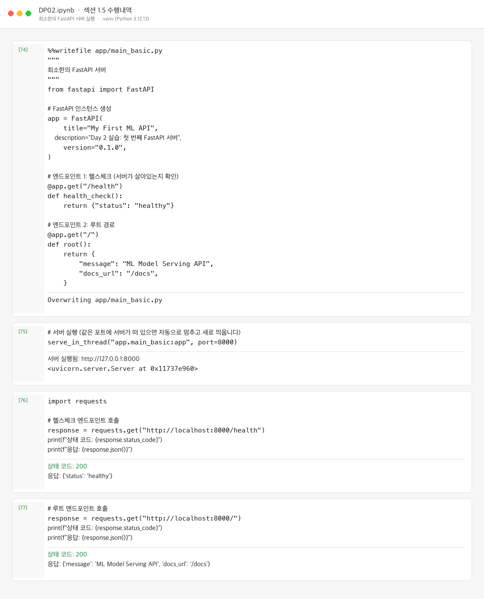
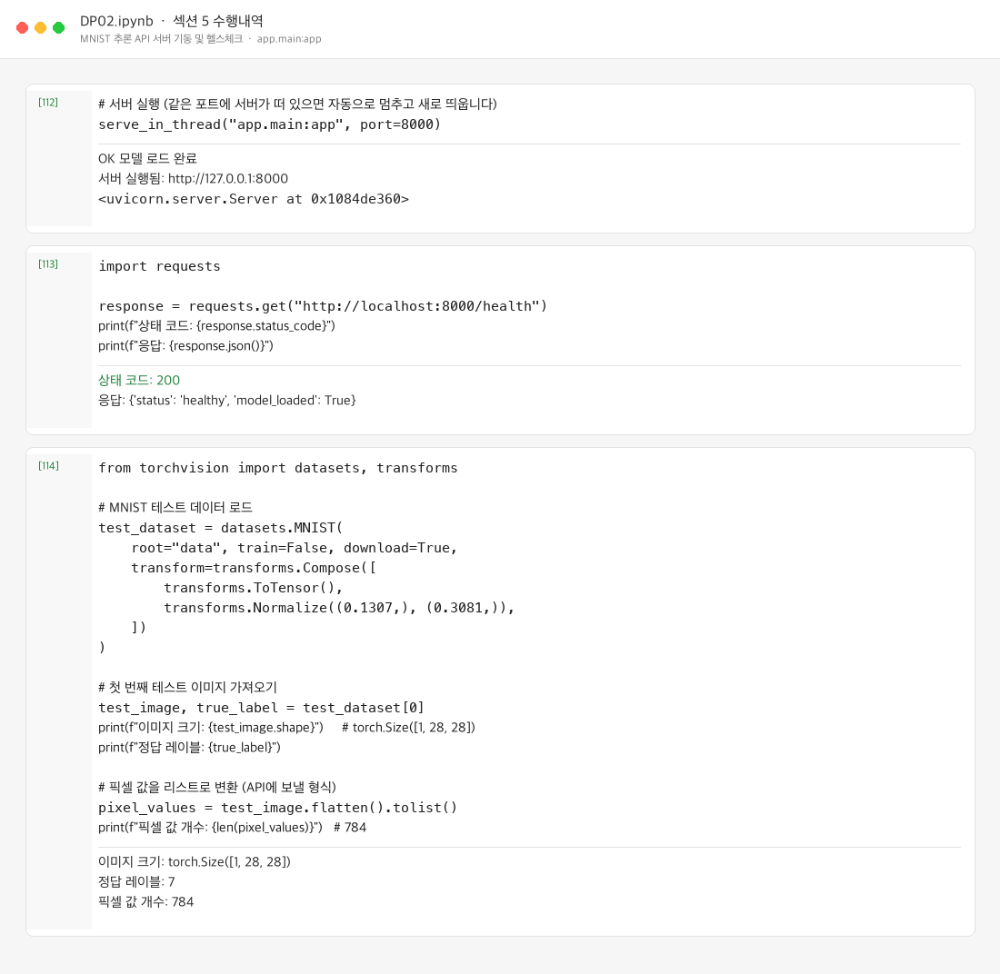
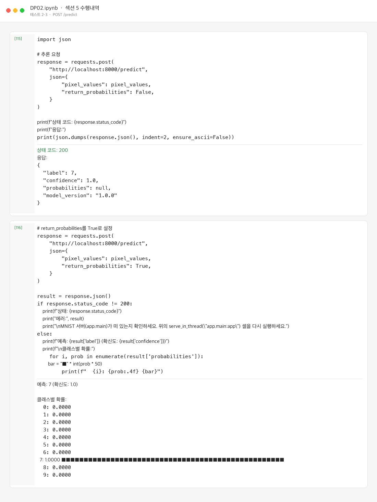
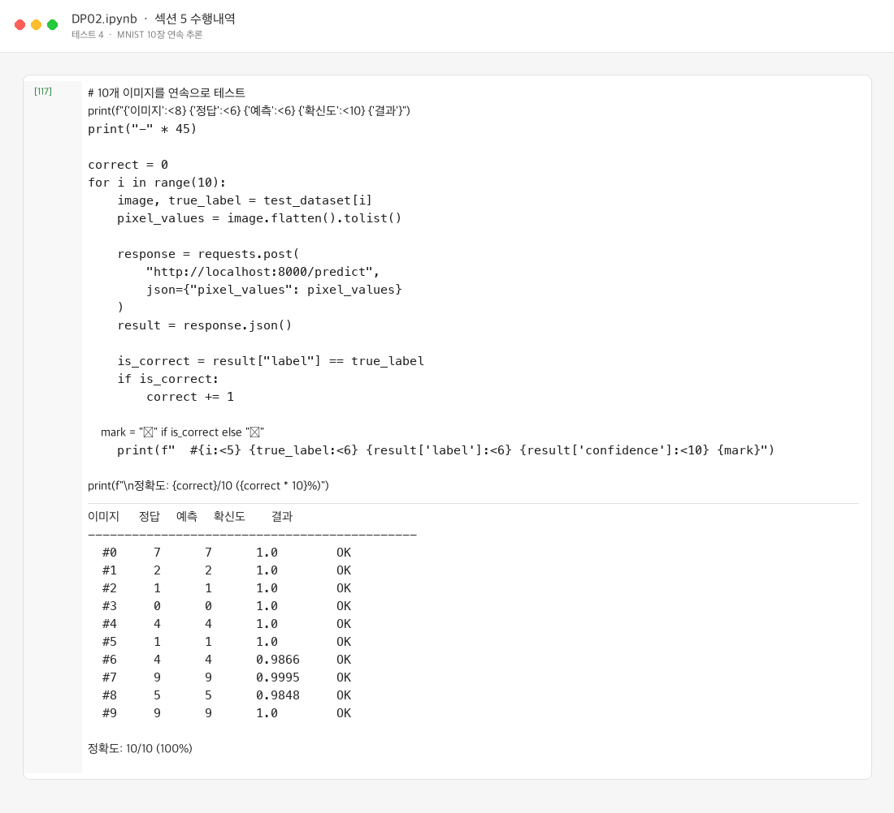
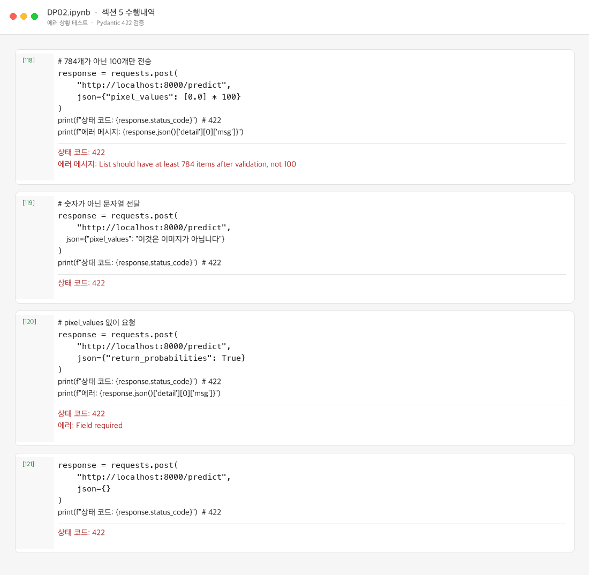
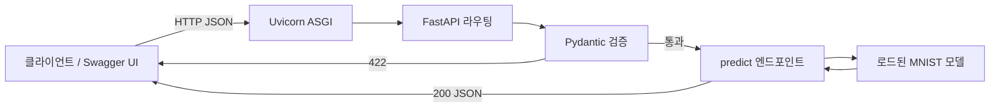

# DP02 제출 — FastAPI 기초와 모델 추론 API

- 코더: 최승현
- 과정: AIFFEL Quest ENG / 06_Deployment / DP02

다음 내역을 기록하고 GitHub에 업로드하여 링크로 제출합니다.

1. 섹션 1.5 수행내역 캡쳐
2. 섹션 2, 3 셀 출력
3. 섹션 5 수행내역 캡쳐
4. 각 섹션 체크포인트의 답변

---

## 1. 섹션 1.5 수행내역 캡쳐

섹션 1.5에서는 최소 FastAPI 서버(`app/main_basic.py`)를 만들고, 노트북의 `serve_in_thread()`로 띄운 뒤 `GET /health`, `GET /` 을 호출했습니다.



| 항목 | 결과 |
|------|------|
| 앱 파일 | `app/main_basic.py` 작성 (`FastAPI`, `/health`, `/`) |
| 실행 방식 | 노트북 안 `serve_in_thread("app.main_basic:app", port=8000)` |
| 헬스체크 | `200` / `{"status": "healthy"}` |
| 루트 | `200` / 메시지 + `docs_url` |

---

## 2. 섹션 2, 3 셀 출력

### 섹션 2 — Path / Query / Request Body

#### Path 파라미터

```
{'model_name': 'sentiment-v1', 'status': 'running', 'version': '1.0.0'}
{'model_name': 'image-classifier', 'status': 'running', 'version': '1.0.0'}
```

#### Path 타입 검증 (`/predictions/{prediction_id}`)

정상 요청(`42`)과 잘못된 요청(`abc`):

```
상태: 200, 응답: {'prediction_id': 42, 'label': '긍정', 'confidence': 0.92}
상태: 422
에러: {'detail': [{'type': 'int_parsing', 'loc': ['path', 'prediction_id'], 'msg': 'Input should be a valid integer, unable to parse string as an integer', 'input': 'abc'}]}
```

#### Query 파라미터 (`/models`)

```
전체 모델: {'total': 3, 'models': [{'name': 'sentiment-v1', 'status': 'running'}, {'name': 'image-clf-v2', 'status': 'running'}, {'name': 'ner-v1', 'status': 'stopped'}]}
running만: {'total': 2, 'models': [{'name': 'sentiment-v1', 'status': 'running'}, {'name': 'image-clf-v2', 'status': 'running'}]}
running, 1개만: {'total': 1, 'models': [{'name': 'sentiment-v1', 'status': 'running'}]}
```

#### Request Body (`POST /predict`)

```
기본 응답: {'label': '긍정', 'confidence': 0.92, 'probabilities': None}
확률 포함: {'label': '긍정', 'confidence': 0.92, 'probabilities': {'긍정': 0.92, '부정': 0.05, '중립': 0.03}}
```

#### 잘못된 Body

```
상태: 422
에러: Field required
상태: 422
에러: Input should be a valid string
```

| 테스트 | 결과 |
|--------|------|
| `text` 누락 | `422` / `Field required` |
| `text`에 숫자 `12345` | `422` / `Input should be a valid string` |

---

### 섹션 3 — Swagger UI / OpenAPI / ReDoc

로컬에서는 Colab iframe 대신 브라우저로 `/docs`를 열었습니다.

```
로컬 환경입니다. 브라우저에서 Swagger UI를 엽니다:
http://localhost:8000/docs
```

#### 자동 생성된 OpenAPI 스펙

```
API 제목: Parameter Examples
API 버전: 0.1.0

등록된 엔드포인트:
  GET    /models/{model_name}
  GET    /predictions/{prediction_id}
  GET    /models
  POST   /predict
```

#### PredictRequest JSON Schema

```json
{
  "properties": {
    "text": {
      "type": "string",
      "title": "Text"
    },
    "return_probabilities": {
      "type": "boolean",
      "title": "Return Probabilities",
      "default": false
    }
  },
  "type": "object",
  "required": [
    "text"
  ],
  "title": "PredictRequest"
}
```

#### ReDoc

```
상태: 200
내용 길이: 902
```

---

## 3. 섹션 5 수행내역 캡쳐

Day 1 모델(`models/mnist_state_dict.pth`)을 FastAPI에 연결해 MNIST 추론 API를 완성했습니다.

### 서버 기동 및 헬스체크



### 테스트 2–3 — 기본 추론 / 확률 분포



### 테스트 4 — 연속 10장



### 에러 상황 테스트



Pydantic `Field(min_length=784, max_length=784)`가 길이 검증을 담당하므로, 784개가 아닌 요청은 모델 추론까지 가지 않고 422로 거절됩니다.

---

## 4. 각 섹션 체크포인트의 답변

### 섹션 1. 들어가며 — FastAPI를 선택하는 이유

**1. FastAPI가 Flask보다 모델 배포에 적합한 이유 세 가지는 무엇입니까?**

1. **자동 데이터 검증 (Pydantic)** — 잘못된 입력이 모델에 닿기 전에 422로 거절됩니다.
2. **자동 API 문서화 (Swagger UI)** — `/docs`에서 코드와 동기화된 문서로 바로 테스트할 수 있습니다.
3. **비동기 처리 (async/await)** — 추론처럼 시간이 걸리는 작업 중에도 다른 요청을 받을 수 있습니다.

**2. Uvicorn의 역할은 무엇이며, 왜 FastAPI와 함께 사용합니까?**

Uvicorn은 ASGI 서버입니다. HTTP 요청을 받아 FastAPI 앱에 전달하는 “문지기” 역할을 합니다. FastAPI 자체는 소켓을 열고 요청을 받는 기능이 없으므로, Uvicorn 같은 ASGI 서버와 함께 실행해야 합니다.

**3. `@app.get("/health")`에서 `get`과 `"/health"`는 각각 무엇을 의미합니까?**

- `get`: HTTP 메서드 GET
- `"/health"`: 이 함수가 처리할 URL 경로

즉 `GET /health` 요청이 오면 `health_check()`가 실행됩니다.

**4. FastAPI에서 dict를 반환하면 어떤 일이 자동으로 일어납니까?**

Python dict가 JSON 응답으로 변환됩니다. `json.dumps()`를 직접 호출할 필요가 없습니다.

---

### 섹션 2. Path, Query, Body

**1. `/models/sentiment-v1`에서 `sentiment-v1`은 어떤 종류의 파라미터입니까?**

Path 파라미터입니다. URL 경로에 포함되어 특정 리소스(`model_name`)를 식별합니다.

**2. `/models?status=running&limit=5`에서 `status`와 `limit`은 어떤 종류의 파라미터입니까?**

Query 파라미터입니다. `?key=value` 형태로 필터·개수 같은 선택 조건을 전달합니다.

**3. 모델 추론 요청에 Request Body를 사용하는 이유는 무엇입니까?**

추론 입력은 텍스트·픽셀 배열처럼 크고 구조화된 JSON입니다. URL에는 길이 제한이 있고 GET에 Body를 넣는 것도 관례에 맞지 않으므로, POST Request Body로 보냅니다.

**4. FastAPI에서 함수의 파라미터가 Path, Query, Body 중 어디서 오는지 어떻게 판별합니까?**

- 경로 `{이름}`에 있으면 **Path**
- 경로에 없고 기본 타입(`str`, `int` 등)이면 **Query**
- Pydantic `BaseModel`이면 **Request Body**

---

### 섹션 3. Swagger UI

**1. FastAPI에서 Swagger UI에 접속하려면 어떤 URL로 이동합니까?**

`http://localhost:8000/docs` (ReDoc은 `http://localhost:8000/redoc`)

**2. Swagger UI가 코드와 항상 동기화될 수 있는 이유는 무엇입니까?**

문서가 별도 파일이 아니라, 앱이 뜰 때 엔드포인트·타입 힌트·Pydantic 모델로부터 OpenAPI 스펙(`/openapi.json`)을 자동 생성하기 때문입니다. 코드를 바꾸면 문서도 같이 바뀝니다.

**3. Pydantic 모델의 `Field(description=, examples=)`는 Swagger UI의 어디에 반영됩니까?**

해당 필드의 설명과 예시로 표시됩니다. Try it out의 요청 스키마·예시 JSON에 그대로 나옵니다.

**4. Swagger UI와 ReDoc의 핵심 차이는 무엇입니까?**

Swagger UI는 브라우저에서 API를 직접 호출하는 대화형 테스트 도구입니다. ReDoc은 읽기 좋은 레퍼런스 문서에 가깝고, 이 과정에서는 Swagger UI를 주로 사용합니다.

---

### 섹션 4. Pydantic 입력 검증

**1. `text: str`과 `text: str = "기본값"`의 차이는 무엇입니까?**

- `text: str` — 필수. 없으면 422
- `text: str = "기본값"` — 선택. 생략하면 기본값 사용

**2. `Field(..., min_length=1, max_length=5000)`에서 `...`은 무엇을 의미합니까?**

필수 필드라는 뜻입니다. (`Ellipsis`) 기본값이 없고, 요청에 반드시 있어야 합니다.

**3. 422 에러 응답에서 `loc` 필드는 어떤 정보를 담고 있습니까?**

검증이 실패한 위치입니다. 예: `["path", "prediction_id"]`, `["body", "text"]`. 어느 계층의 어느 필드가 잘못됐는지 알려 줍니다.

**4. `response_model`을 지정하면 어떤 이점이 있습니까?**

- Swagger UI에 응답 스키마가 문서화됩니다.
- 스키마에 없는 필드는 응답에서 제거됩니다.
- 내부 데이터가 실수로 노출되는 것을 막습니다.

---

### 섹션 5. 모델 추론 엔드포인트

**1. 모델을 서버 시작 시 한 번만 로드해야 하는 이유는 무엇입니까?**

가중치 로드는 수 초가 걸릴 수 있습니다. 요청마다 로드하면 지연이 커지고 메모리를 반복 사용합니다. 모듈 레벨에서 한 번 로드해 두고 추론만 반복하는 것이 맞습니다.

**2. pixel_values가 784개가 아닌 요청이 들어오면 어떤 일이 발생합니까? 이를 처리하는 코드를 직접 작성했습니까?**

Pydantic이 `min_length=784`, `max_length=784`로 검증해 **422**를 반환합니다. `if len(...) != 784` 같은 수동 분기는 작성하지 않았습니다. 스키마 선언만으로 FastAPI가 처리합니다.

**3. HTTPException(status_code=503)은 어떤 상황에서 사용했습니까? 왜 500이 아니라 503입니까?**

모델 로드에 실패했거나 `model_loaded=False`일 때 사용합니다. **500**은 요청 처리 중 서버 내부 오류, **503 Service Unavailable**은 “서비스가 아직/일시적으로 준비되지 않음”입니다. 모델이 없으면 추론을 할 수 없는 상태이므로 503이 맞습니다.

**4. Swagger UI에서 PredictRequest의 description과 examples가 어디에 표시됩니까?**

`POST /predict`를 펼친 뒤 Request Body 스키마에 필드 설명으로 나오고, Try it out의 예시 JSON에도 `examples`가 반영됩니다.

---

## 실행 흐름


