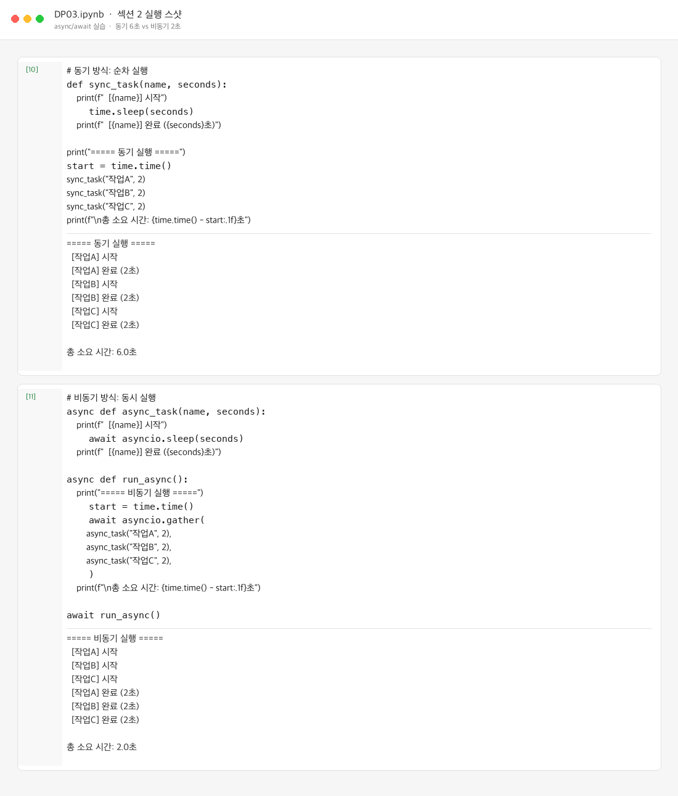
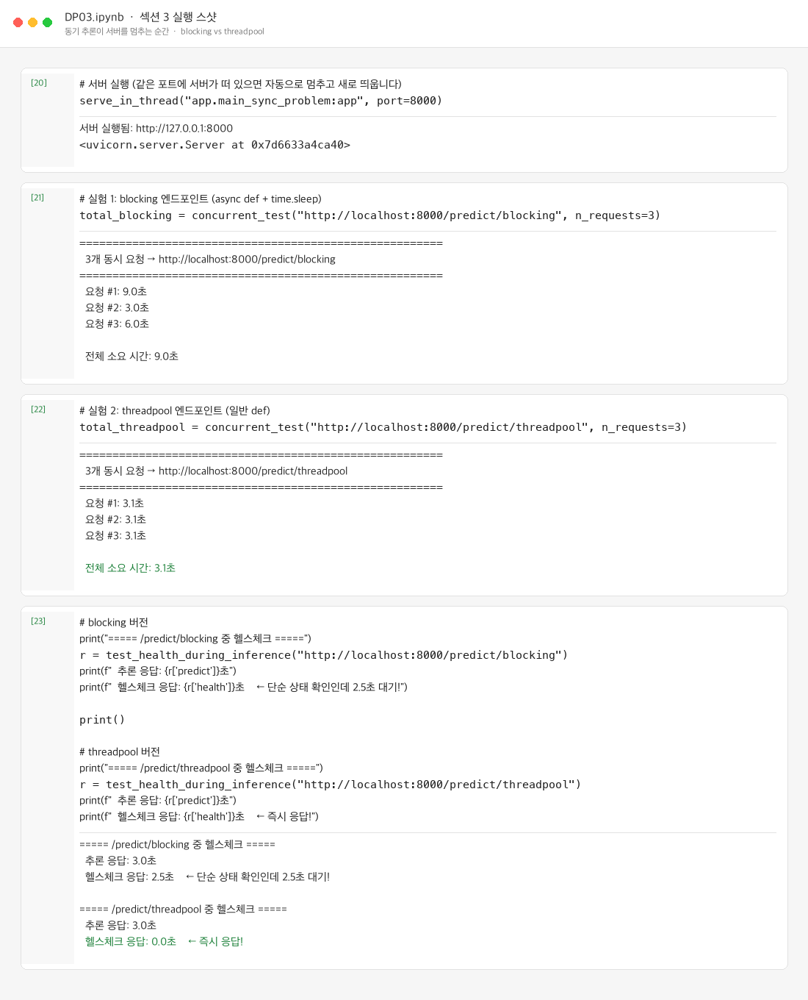
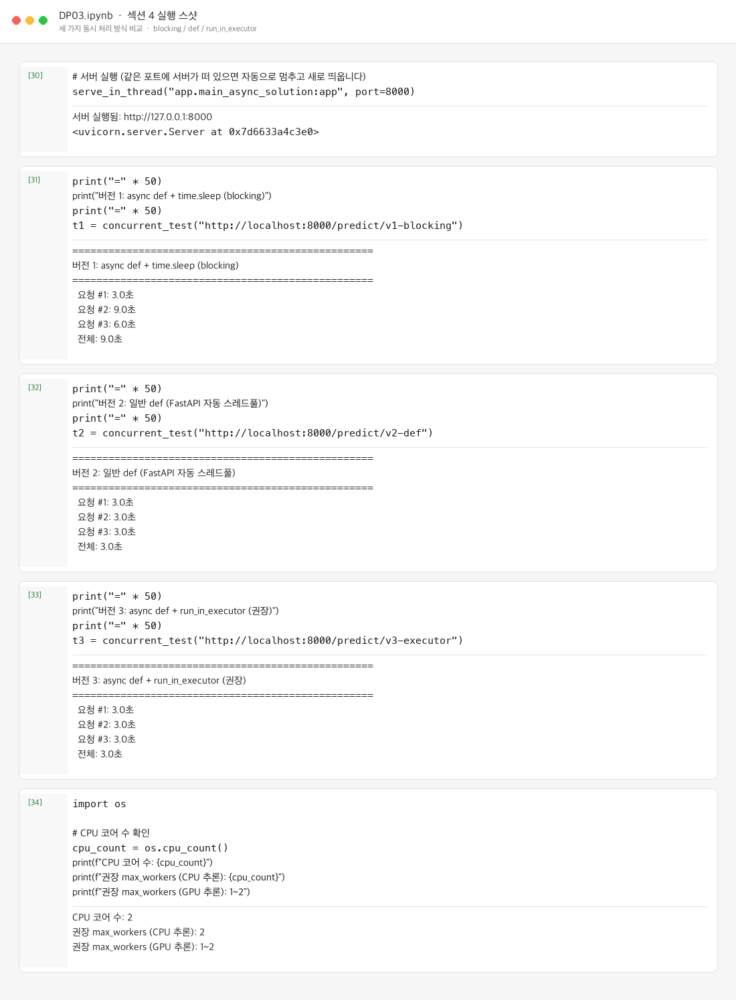
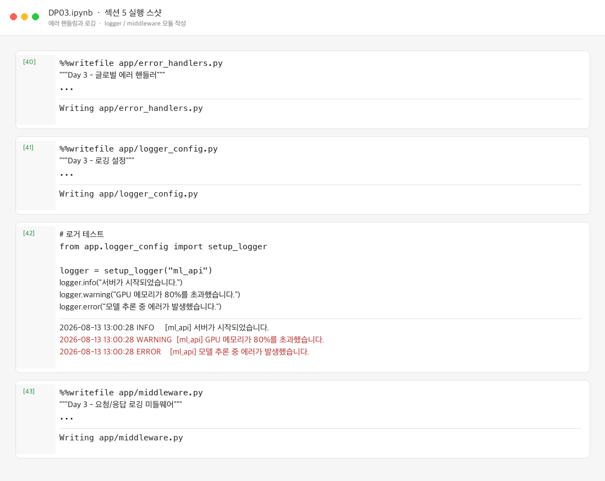
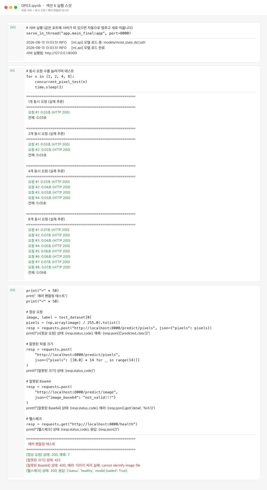
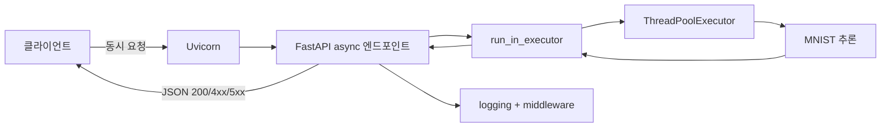

# DP03 제출 — 비동기 처리와 에러 핸들링

- 코더: 최승현
- 과정: AIFFEL Quest ENG / 06_Deployment / DP03

다음 내역을 기록하고 GitHub에 업로드하여 링크로 제출합니다.

1. 각 섹션 실행 스샷
2. 각 섹션 체크포인트의 답변

---

## 1. 각 섹션 실행 스샷

### 섹션 2 — async/await 실습

동기 `time.sleep`은 순차로 약 6초, 비동기 `asyncio.sleep` + `gather`는 약 2초가 걸렸습니다.

---

### 섹션 3 — 동기 추론이 서버를 멈추는 순간

`async def` + `time.sleep` blocking은 3개 동시 요청이 약 9초, 일반 `def`(스레드풀)는 약 3초였습니다. blocking 중에는 헬스체크도 지연되었습니다.

---

### 섹션 4 — run_in_executor 해결 패턴

버전 1(blocking)만 9초, 버전 2(`def`)와 버전 3(`run_in_executor`)는 모두 약 3초로 동시 처리되었습니다.

---

### 섹션 5 — 에러 핸들링과 로깅

글로벌 핸들러·로거·미들웨어 모듈을 작성하고, 레벨별 로그 출력을 확인했습니다.

---

### 섹션 6 — 최종 서버 + 동시 요청 테스트

`app.main_final` 서버로 실제 MNIST 추론을 1~8개 동시 요청했고, 잘못된 입력은 422/400으로 거절되었습니다.

---

## 2. 각 섹션 체크포인트의 답변

### 섹션 2. async/await의 기본 원리

**1. `time.sleep(3)`과 `await asyncio.sleep(3)`의 핵심 차이는 무엇입니까?**

`time.sleep(3)`은 스레드(이벤트 루프 포함)를 통째로 멈춰 다른 작업을 못 합니다. `await asyncio.sleep(3)`은 기다리는 동안 이벤트 루프에 제어권을 넘겨, 다른 코루틴을 실행할 수 있습니다.

**2. 모델 추론처럼 CPU를 계속 사용하는 작업에서 `async/await`만으로 동시 처리가 안 되는 이유는 무엇입니까?**

`async/await`는 I/O 대기처럼 “기다리는 틈”을 활용하는 방식입니다. CPU 바운드 추론은 그 틈이 거의 없어 이벤트 루프를 계속 점유하므로, `run_in_executor`로 별도 스레드/프로세스에 넘겨야 합니다.

---

### 섹션 3. 동기 추론이 서버를 멈추는 순간

**1. `async def` 안에서 `time.sleep(3)`을 호출하면 왜 다른 요청까지 지연됩니까?**

`async def`는 이벤트 루프에서 돌아가는데, `time.sleep`이 그 루프를 블로킹합니다. 루프가 멈추면 다른 요청·헬스체크도 처리되지 않습니다.

**2. 일반 `def`로 선언된 엔드포인트는 FastAPI가 내부적으로 어떻게 처리합니까?**

FastAPI가 스레드풀에서 실행합니다. 이벤트 루프는 막히지 않고, 여러 `def` 엔드포인트가 스레드풀 한도 안에서 동시에 돌 수 있습니다.

**3. blocking 추론 중 헬스체크까지 막히면 실무에서 어떤 문제가 발생할 수 있습니까?**

로드밸런서·오케스트레이터가 서버를 죽은 것으로 판단해 트래픽을 빼거나 재시작할 수 있습니다. 장애 감지·모니터링도 실패해 장애가 커질 수 있습니다.

---

### 섹션 4. run_in_executor 해결 패턴

**1. `run_in_executor`가 이벤트 루프 블로킹을 방지하는 원리는 무엇입니까?**

무거운 동기 함수를 별도 스레드풀에서 실행하고, 이벤트 루프는 `await`로 완료만 기다립니다. 그동안 루프는 다른 요청을 처리할 수 있습니다.

**2. `run_in_executor`의 첫 번째 인자에 `None`을 넣으면 어떤 스레드풀이 사용됩니까?**

이벤트 루프의 기본(default) 스레드풀이 사용됩니다.

**3. 일반 `def`와 `async def + run_in_executor`의 핵심 차이는 무엇입니까?**

- 일반 `def`: FastAPI가 자동으로 스레드풀에 넣습니다. 구현은 단순합니다.
- `async def + run_in_executor`: 어떤 스레드풀을 쓸지, 전처리/후처리를 루프에서 할지 명시적으로 나눌 수 있습니다. 커스텀 executor·동시성 제어에 유리합니다.

**4. GPU 추론 시 스레드풀 크기를 1~2로 제한하는 이유는 무엇입니까?**

GPU는 동시에 많은 추론을 넣어도 이득이 적고, 메모리 경쟁·컨텍스트 스위칭으로 오히려 느려지거나 OOM이 날 수 있습니다. 큐잉하며 소수의 워커만 쓰는 편이 안정적입니다.

---

### 섹션 5. 에러 핸들링과 로깅

**1. 글로벌 Exception Handler를 사용하면 어떤 반복을 줄일 수 있습니까?**

엔드포인트마다 `try/except`로 500 응답을 만드는 반복을 줄입니다. 예외 형식·로깅 정책을 한곳에서 통일할 수 있습니다.

**2. 클라이언트에게 스택 트레이스를 노출하면 안 되는 이유는 무엇입니까?**

파일 경로, 라이브러리 버전, 내부 로직 등 공격에 쓰일 정보가 드러납니다. 상세는 서버 로그에만 남기고, 클라이언트에는 안전한 메시지만 보내야 합니다.

**3. `logging` 모듈이 `print()`보다 나은 점은 무엇입니까?**

레벨(INFO/WARNING/ERROR), 포맷, 출력 대상(콘솔/파일)을 제어할 수 있고, 운영 환경에서 필터링·수집이 쉽습니다. `print`는 이런 구조가 없습니다.

---

### Day 3 최종 체크포인트

**Q1. 동기 서버에서 3초 걸리는 추론을 3명이 동시에 요청하면 총 몇 초 걸립니까?**

약 **9초**입니다. (3초 × 3, 순차 처리)

**Q2. time.sleep(3)과 await asyncio.sleep(3)의 핵심 차이는?**

전자는 스레드/이벤트 루프를 막고, 후자는 대기 중 다른 코루틴을 실행할 수 있습니다.

**Q3. async def 안에서 동기 블로킹 코드를 실행하면 왜 헬스체크까지 영향받습니까?**

이벤트 루프가 막히면 같은 루프에서 처리하는 모든 요청(헬스체크 포함)이 대기하기 때문입니다.

**Q4. run_in_executor가 이벤트 루프 블로킹을 방지하는 원리는?**

동기 작업을 스레드풀로 넘기고, 루프는 await로 결과만 받아 다른 일을 계속합니다.

**Q5. 글로벌 Exception Handler를 사용하는 이유는?**

예상치 못한 예외를 일관된 500 응답으로 처리하고, 상세 오류는 로그에만 남겨 서버 안정성과 보안을 지키기 위해서입니다.

**Q6. 클라이언트에게 스택 트레이스를 노출하면 안 되는 이유는?**

내부 구현·경로 정보가 유출되어 보안 위험이 커지기 때문입니다.

---

## 실행 흐름 요약

