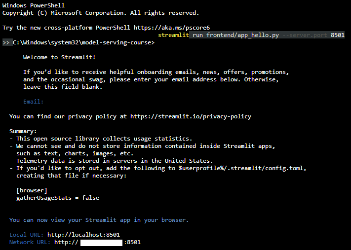
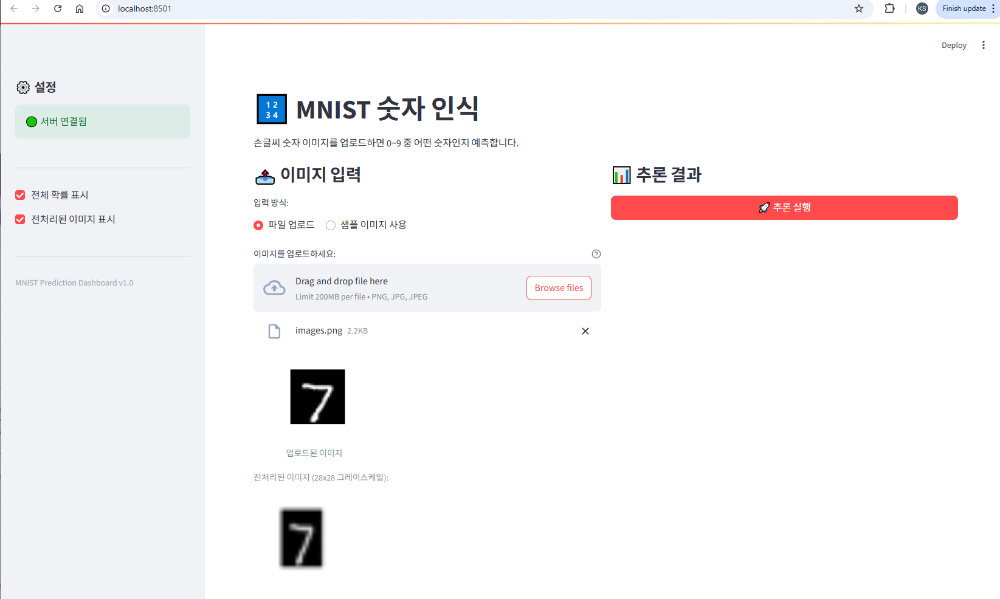
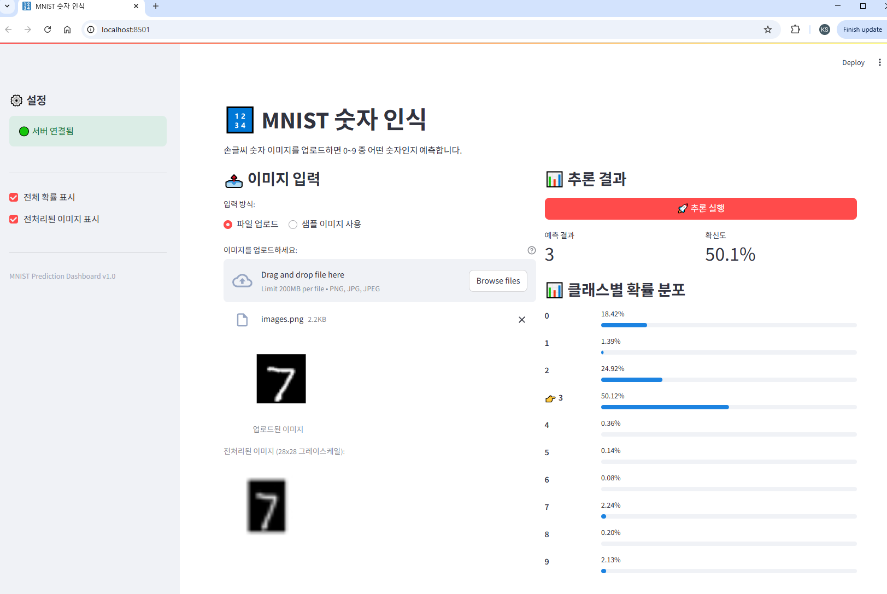
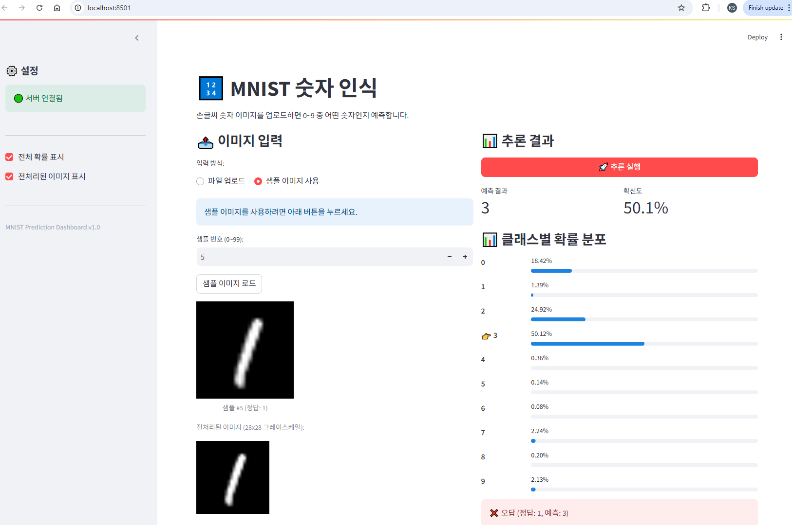
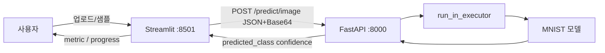

# DP04 제출 — Streamlit & System Architecture

- 코더: 최승현
- 과정: AIFFEL Quest ENG / 06_Deployment / DP04

다음 내역을 기록하고 GitHub에 업로드하여 링크로 제출합니다.

1. 섹션 5 수행내역 캡쳐
2. 각 섹션 체크포인트의 답변

---

## 1. 섹션 5 수행내역 캡쳐

섹션 5에서는 MNIST 추론 대시보드(`frontend/app_dashboard.py`)를 만들고, FastAPI 백엔드(`app.main_final:app`, 포트 8000)와 Streamlit 프론트(포트 8501)를 연결해 테스트했습니다.

| 항목 | 결과 |
|------|------|
| 대시보드 | `frontend/app_dashboard.py` (`call_api`, Base64, `st.session_state`) |
| 백엔드 | `serve_in_thread("app.main_final:app", port=8000)` |
| 프론트 | `streamlit run frontend/app_dashboard.py --server.port 8501` |
| 확인 URL | `http://localhost:8501` |

### 프론트엔드 실행

### 이미지 입력

업로드(또는 샘플) 후 입력 영역에 이미지가 표시됩니다.

### 추론 실행

「추론 실행」 후 `st.metric`으로 예측 숫자·확신도가 나오고, 확률 바가 표시됩니다.

### 샘플 이미지 테스트

샘플 숫자로도 같은 흐름이 동작합니다.

---

## 2. 각 섹션 체크포인트의 답변

### 섹션 1. Streamlit 소개

**1. Streamlit의 스크립트 재실행 모델이란 무엇입니까?**

위젯 값이 바뀔 때마다 Python 스크립트를 **처음부터 다시 실행**하는 방식입니다. 이벤트 핸들러를 따로 두지 않고, 현재 위젯 상태로 화면을 다시 그립니다.

**2. `st.text_input()`에 값을 입력하면 내부적으로 어떤 일이 일어납니까?**

입력값이 세션에 저장되고 스크립트가 재실행됩니다. 재실행 때 `st.text_input()`은 방금 입력한 값을 반환하므로, 그 값으로 UI를 다시 구성합니다.

**3. `st.set_page_config()`를 스크립트 중간에 호출하면 어떻게 됩니까?**

페이지 설정은 다른 Streamlit 명령보다 **먼저** 호출해야 합니다. 중간에 두면 에러가 납니다.

---

### 섹션 2. Streamlit 핵심 컨셉

**1. `st.file_uploader()`로 업로드된 파일의 바이트 데이터는 어떻게 얻습니까?**

반환된 객체의 `.getvalue()` 또는 `.read()`로 바이트를 읽습니다. 예: `uploaded.getvalue()`.

**2. Streamlit에서 `@st.cache_resource`를 사용하는 이유는 무엇입니까?**

스크립트가 매번 재실행되어도 HTTP 클라이언트처럼 **한 번만 만들고 재사용**하려고입니다. 매 재실행마다 객체를 새로 만들면 느려집니다.

---

### 섹션 3. System Architecture

**1. 모놀리식과 분리 아키텍처의 핵심 차이를 한 문장으로 설명하세요.**

모놀리식은 UI와 모델이 한 프로세스에 있고, 분리 아키텍처는 Streamlit(프론트)과 FastAPI(추론)가 **HTTP로만** 통신합니다.

**2. 모델을 업데이트할 때, 분리 아키텍처에서는 어떤 서버만 재배포하면 됩니까?**

FastAPI 백엔드만 재배포하면 됩니다. Streamlit은 같은 API 계약을 그대로 호출합니다.

**3. Streamlit 앱에 PyTorch가 설치되어 있지 않아도 되는 이유는 무엇입니까?**

모델 추론은 FastAPI가 담당하고, Streamlit은 이미지·JSON만 주고받기 때문입니다.

---

### 섹션 4. Streamlit에서 FastAPI 호출하기

**1. 이미지를 API에 전송할 때 Base64로 인코딩하는 이유는 무엇입니까?**

JSON 본문에는 이진 데이터를 그대로 넣기 어렵습니다. Base64로 문자열로 바꾸면 `{"image_base64": "..."}` 형태로 POST할 수 있습니다.

**2. `response.raise_for_status()`는 어떤 역할을 합니까?**

HTTP 4xx/5xx이면 예외를 던집니다. 호출부에서 성공 응답만 파싱하고, 실패는 `except`에서 `st.error()`로 안내할 수 있습니다.

---

### Day 4 최종 체크포인트

**Q1. Streamlit의 스크립트 재실행 모델이란?**

위젯 변경 시 스크립트 전체를 다시 실행해, 현재 입력으로 UI를 다시 그리는 모델입니다.

**Q2. `@st.cache_resource`를 사용하는 이유는?**

재실행마다 무거운 객체(API 클라이언트 등)를 다시 만들지 않기 위해서입니다.

**Q3. 프론트엔드와 백엔드를 분리하는 핵심 이유 두 가지는?**

1. 모델 배포와 UI 배포를 독립적으로 할 수 있습니다.  
2. 역할이 나뉘어 프론트는 화면, 백엔드는 추론만 담당합니다.

**Q4. Streamlit 앱에 PyTorch가 필요 없는 이유는?**

추론은 백엔드 API가 하고, 프론트는 HTTP 클라이언트만 있으면 되기 때문입니다.

**Q5. API 호출 실패 시 사용자에게 스택 트레이스가 아닌 메시지를 보여줘야 하는 이유는?**

내부 경로·구현이 노출되면 보안 위험이 있고, 사용자는 연결 실패·서버 오류처럼 **할 일**이 보이는 안내가 필요합니다.

**Q6. `st.session_state`에 결과를 저장하는 이유는?**

버튼 클릭 후 스크립트가 재실행되면 지역 변수는 사라집니다. `session_state`에 두면 예측 결과가 화면에 남습니다.

**Q7. 이미지를 API로 전달할 때 Base64 인코딩이 필요한 이유는?**

JSON으로 이미지를 실으려면 바이너리를 텍스트로 바꿔야 하기 때문입니다.

---

## 실행 흐름 요약

