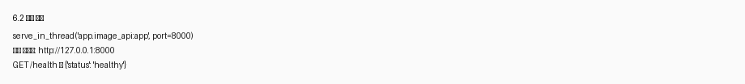
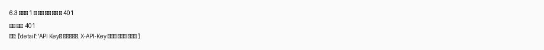
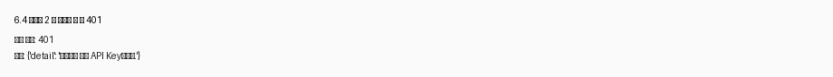
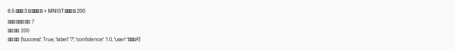
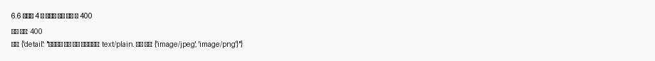
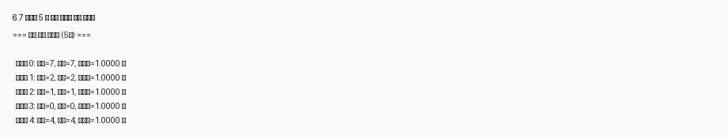
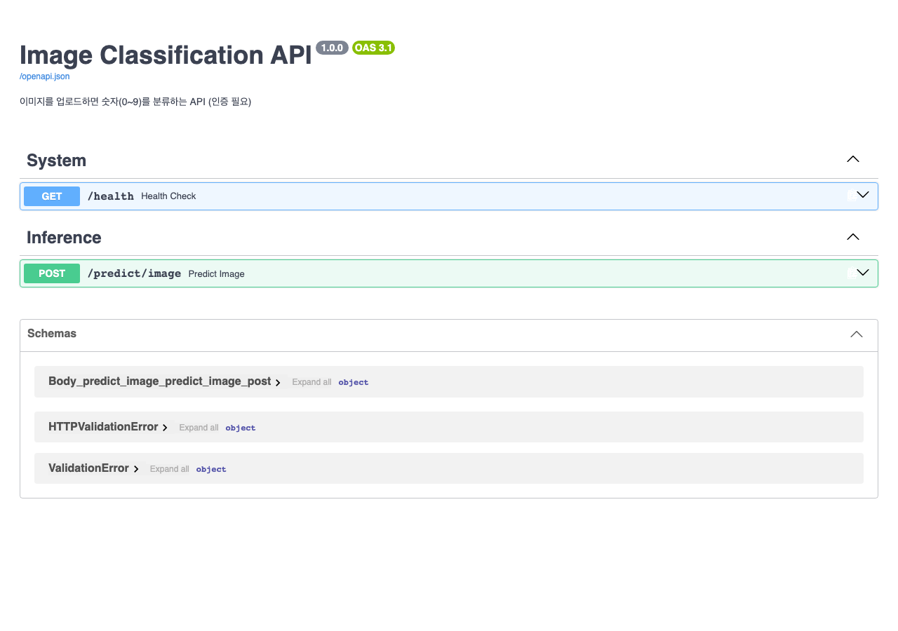
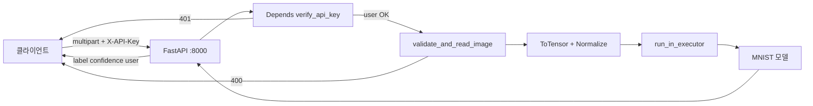

# DP06 제출 — API Key 인증 & 이미지 업로드

- 코더: 최승현
- 과정: AIFFEL Quest ENG / 06_Deployment / DP06

다음 내역을 기록하고 GitHub에 업로드하여 링크로 제출합니다.

1. 섹션 6 수행내역 캡쳐 (6.8 Swagger UI 포함)
2. 각 섹션 체크포인트의 답변

---

## 1. 섹션 6 수행내역 캡쳐

섹션 6에서는 `app/image_api.py`에 API Key 인증, `UploadFile` 업로드, MNIST 추론을 결합한 `/predict/image` 엔드포인트를 완성하고 5가지 통합 테스트를 수행했습니다.

| 항목 | 결과 |
|------|------|
| 인증 | `app/auth.py` — `verify_api_key`, `X-API-Key` 헤더 |
| 파일 검증 | `app/image_utils.py` — MIME·크기·디코딩·28×28 그레이스케일 |
| API | `app/image_api.py` — `Depends(verify_api_key)` + `run_in_executor` |
| 백엔드 | `serve_in_thread("app.image_api:app", port=8000)` |
| Swagger | `http://localhost:8000/docs` |

### 6.2 서버 실행

### 6.3 테스트 1 — 인증 없이 요청 → 401

### 6.4 테스트 2 — 잘못된 키 → 401

### 6.5 테스트 3 — 올바른 키 + MNIST → 200

### 6.6 테스트 4 — 잘못된 파일 형식 → 400

### 6.7 테스트 5 — 연속 추론 (5장)

5장 모두 정답과 예측이 일치했습니다.

### 6.8 Swagger UI에서 테스트 (필수)

`POST /predict/image`에 `x-api-key: test-key-001`과 이미지 파일을 업로드해 Execute할 수 있습니다.

---

## 2. 각 섹션 체크포인트의 답변

### 섹션 1. API Key 인증의 필요성

**1. 인증 없는 API가 위험한 이유를 두 가지 이상 설명하세요.**

- **무단 사용·비용 폭증**: 누구나 호출하면 GPU/CPU 추론 자원을 마음대로 쓸 수 있어 서버 비용과 부하가 급증합니다.
- **데이터·모델 노출**: 악의적 사용자가 대량 요청·입력 조작으로 모델 동작을 탐색하거나, 로그·응답을 통해 내부 정보를 수집할 수 있습니다.
- **책임 추적 불가**: 누가 얼마나 호출했는지 알 수 없어 악용·과금·감사(audit)가 어렵습니다.

**2. API Key 방식이 ML 추론 API에 적합한 이유는 무엇입니까?**

ML 추론 API는 보통 **서버 간·배치·내부 서비스** 호출이 많고, OAuth처럼 사용자 로그인 UI가 필요하지 않습니다. API Key는 헤더 하나(`X-API-Key`)로 간단히 식별·차단할 수 있어, MLOps·내부 마이크로서비스 연동에 적합합니다.

---

### 섹션 2. FastAPI API Key 인증 구현

**1. `Header(None)`에서 `None`은 어떤 상황에서 `x_api_key`에 들어갑니까?**

클라이언트가 **`X-API-Key` 헤더를 아예 보내지 않았을 때** `None`이 들어갑니다. `Header(None)`은 “헤더가 없어도 기본값 None으로 받겠다”는 뜻입니다.

**2. `Depends(verify_api_key)`를 엔드포인트에 추가하면 요청 처리 흐름이 어떻게 바뀝니까?**

FastAPI가 **엔드포인트 본문을 실행하기 전에** `verify_api_key`를 먼저 호출합니다. 키가 없거나 잘못되면 `HTTPException(401)`으로 즉시 종료되고, 통과하면 반환된 사용자 이름(예: `"사용자A"`)이 `user` 인자로 주입된 뒤 본문 로직(파일 검증·추론)이 실행됩니다.

**3. 인증 실패 시 반환하는 HTTP 상태 코드 401의 의미는 무엇입니까?**

**Unauthorized** — “인증 자격(여기서는 API Key)이 없거나 유효하지 않다”는 뜻입니다. 서버는 요청 형식은 이해했지만, **신원 확인에 실패**해 리소스를 제공하지 않습니다.

---

### 섹션 4. 이미지 업로드 & 안전장치

**1. `UploadFile`과 Base64 방식의 핵심 차이는 무엇입니까?**

- **UploadFile**: `multipart/form-data`로 **바이너리 파일을 그대로** 전송합니다. Swagger·브라우저·curl에서 “파일 선택”으로 바로 업로드할 수 있습니다.
- **Base64**: 이미지를 **JSON 문자열**로 인코딩해 본문에 넣습니다. 페이로드가 약 33% 커지고, 클라이언트·서버 모두 인코딩/디코딩 단계가 필요합니다.

**2. `file.content_type`으로 타입을 검증하는 이유는 무엇입니까?**

클라이언트가 선언한 **MIME 타입**으로 `text/plain` 같은 명백히 잘못된 요청을 **1차로 빠르게 거르기** 위해서입니다. 다만 `content_type`은 위조 가능하므로, 이후 **PIL 디코딩**으로 실제 이미지 여부를 다시 확인해야 합니다.

**3. 파일 크기를 제한하지 않으면 어떤 문제가 발생할 수 있습니까?**

- **메모리·디스크 고갈**: 거대 파일 업로드로 서버 RAM/임시 디스크가 소진될 수 있습니다.
- **DoS(서비스 거부)**: 의도적으로 큰 파일을 반복 업로드해 추론 API를 마비시킬 수 있습니다.
- **응답 지연**: 불필요하게 큰 파일을 읽·검증·리사이즈하는 데 시간이 낭비됩니다.

---

### Day 6 최종 체크포인트

**Q1. API Key 인증이 없으면 어떤 위험이 있습니까? (두 가지 이상)**

- 추론 API를 **무제한 호출**해 자원·비용이 폭증할 수 있습니다.
- **악의적 입력**으로 모델·시스템을 탐색하거나 남용할 수 있습니다.
- 호출 주체를 **추적·차단**하기 어렵습니다.

**Q2. Depends(verify_api_key)는 엔드포인트 실행 전에 어떤 일을 합니까?**

`X-API-Key` 헤더 값을 읽어 유효한 키인지 검사합니다. 없거나 틀리면 401을 반환하고, 맞으면 등록된 **사용자 이름**을 엔드포인트에 넘긴 뒤 본문을 실행합니다.

**Q3. UploadFile 방식이 Base64보다 편리한 점은 무엇입니까?**

파일을 **그대로 multipart로** 보내므로 인코딩/디코딩이 없고, Swagger UI·HTTP 클라이언트에서 **파일 선택 한 번**으로 테스트하기 쉽습니다. 대용량 이미지에서도 Base64보다 효율적입니다.

**Q4. 파일 업로드 시 크기 제한을 하지 않으면 어떤 문제가 생깁니까?**

서버 **메모리·디스크 부족**, **느린 응답**, **DoS 공격**에 취약해집니다. 학습용으로는 5MB처럼 상한을 두어 한 요청이 차지하는 자원을 제한합니다.

**Q5. 이미지를 28x28 그레이스케일로 변환하는 이유는 무엇입니까?**

MNIST 모델은 **28×28 단일 채널(그레이스케일)** 입력으로 학습되었습니다. 업로드 이미지 크기·채널(RGB 등)이 달라도 `convert("L").resize((28, 28))`로 **모델 입력 텐서 shape `(1, 1, 28, 28)`**에 맞춰야 올바르게 추론할 수 있습니다.

---

## 실행 흐름 요약

---

## 회고

**배운 점**

- `Depends()`로 인증을 엔드포인트 **앞단**에 두면 본문 코드가 “이미 인증된 사용자”만 다루게 되어 구조가 깔끔해집니다.
- `UploadFile` 검증은 MIME → 크기 → PIL 디코딩 → 리사이즈 **순서**가 역할 분담이 명확합니다.
- Mac 로컬에서는 Swagger를 iframe이 아니라 **브라우저**(`http://localhost:8000/docs`)로 여는 것이 안정적입니다.

**아쉬운 점 / 개선**

- API Key를 코드에 하드코딩했으므로, 실무에서는 환경 변수·Secrets Manager로 옮겨야 합니다.
- 파일 크기 검증은 “다 읽은 뒤” 거부하므로, nginx `client_max_body_size`나 스트림 단위 읽기로 **업로드 중** 차단하는 방식을 추가하면 좋겠습니다.
