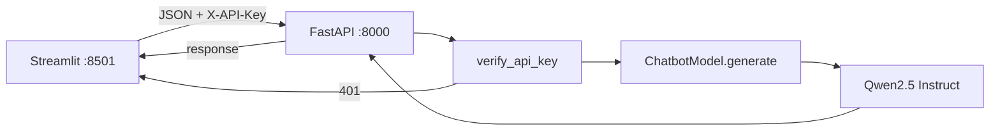
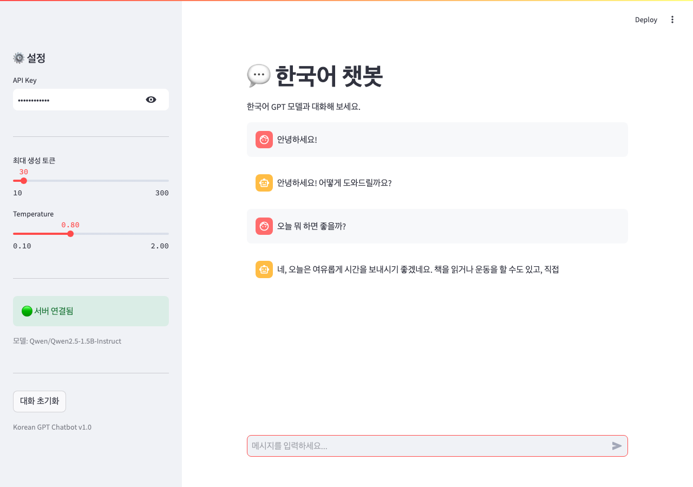
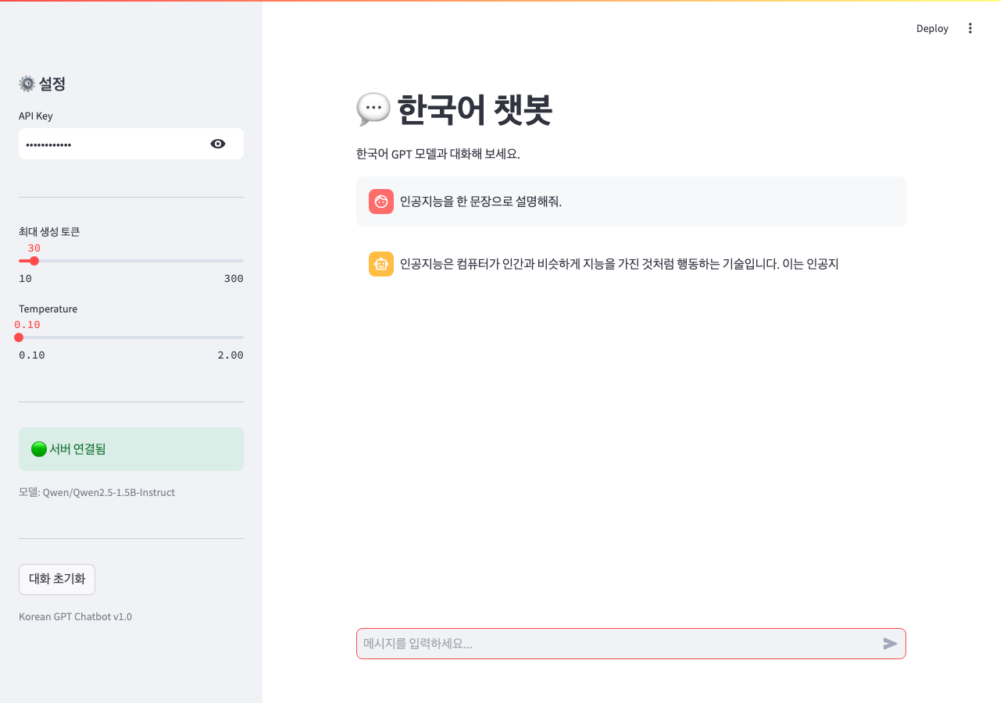
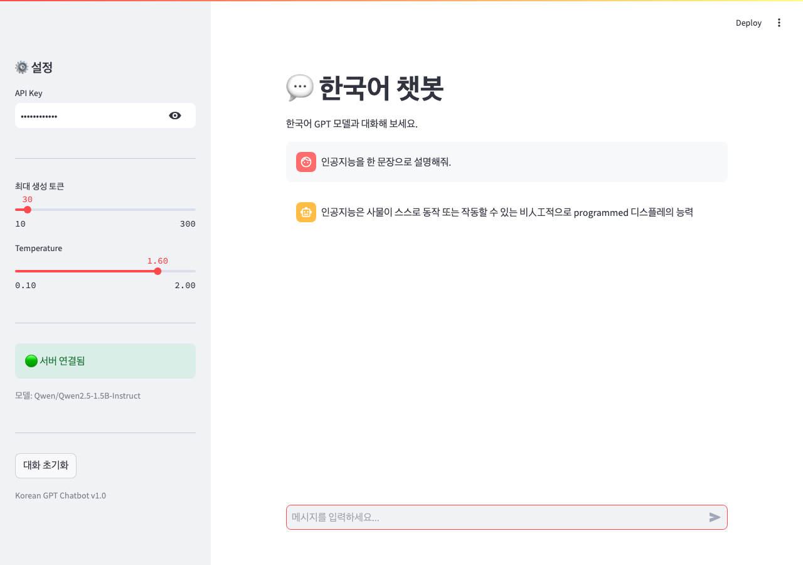
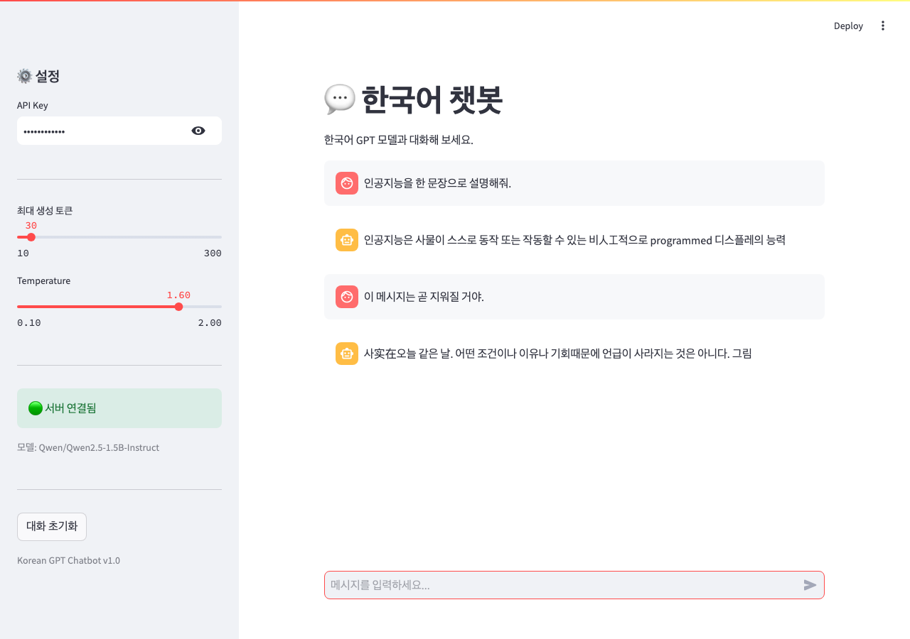
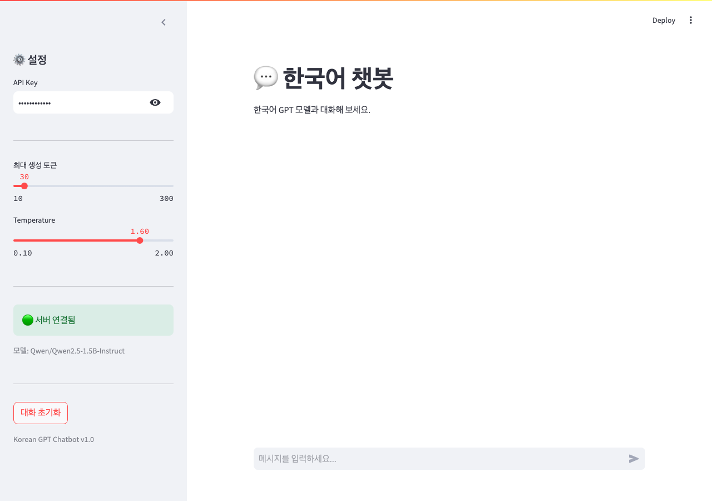
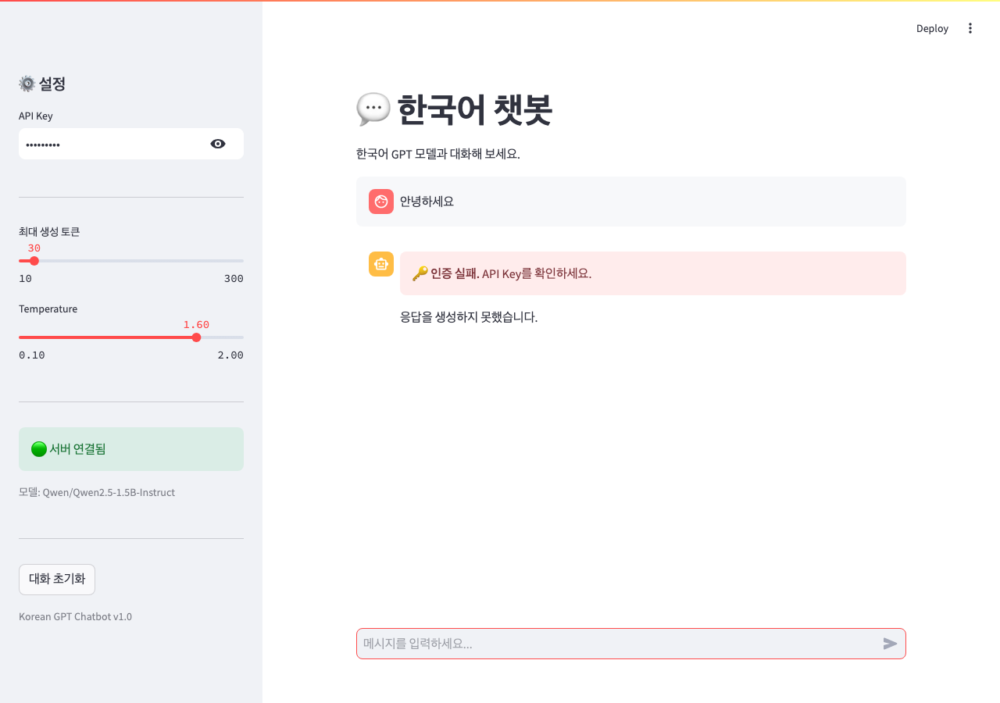

# DP07 제출 — 트랜스포머 챗봇 서비스 (한국어 GPT)

- 코더: 최승현
- 과정: AIFFEL Quest ENG / 06_Deployment / DP07
- 실행 환경: Mac (Apple Silicon, MPS)
- 기본 모델: `Qwen/Qwen2.5-1.5B-Instruct`

다음 내역을 기록하고 GitHub에 업로드하여 링크로 제출합니다.

1. 프로젝트 실행 내역 캡쳐와 설명 (테스트 1~4, UI 테스트)
2. 각 섹션 체크포인트의 답변
3. 프로젝트 회고

> UI 캡처는 `./assets/`에 넣을 예정입니다. (초안 — 스크린샷은 추후 보완)

---

## 1. 프로젝트 실행 내역

### 1.1 구성 요약

| 항목 | 내용 |
|------|------|
| 모델 | Hugging Face `Qwen/Qwen2.5-1.5B-Instruct` (MPS) |
| 백엔드 | `app/chatbot_api.py` — `/health`, `/chat` + API Key |
| 스키마 | `ChatRequest` / `ChatResponse` (멀티턴 `messages` 리스트) |
| 추론 | `ChatbotModel` + `run_in_executor` (stateless) |
| 프론트 | Streamlit `frontend/app_chatbot.py` (`st.chat_message`, `st.chat_input`) |
| 인증 | Day 6 `app/auth.py` 재사용 (`test-key-001`) |

### 1.2 통합 테스트 1~4 (API)

Mac에서 서버(`:8000`) 기동 후 실행한 결과입니다.

#### 테스트 1: 인증

| 케이스 | 결과 |
|--------|------|
| 인증 없음 | HTTP **401** |
| 잘못된 키 (`wrong-key`) | HTTP **401** |
| 올바른 키 (`test-key-001`) | HTTP **200**, 한국어 응답 생성 |

#### 테스트 2: 멀티턴 대화

3턴(`안녕하세요!` → `오늘 뭐 하면 좋을까?` → `맛있는 거 추천해줘`)을 클라이언트가 전체 `messages`로 전송.  
서버는 상태를 저장하지 않고, 매 요청의 히스토리를 받아 응답을 이어 감. **총 대화 턴 3** 확인.

#### 테스트 3: 입력 검증

| 케이스 | 결과 |
|--------|------|
| 빈 `messages` | HTTP **422** |
| `temperature: 5.0` (범위 초과) | HTTP **422** |

#### 테스트 4: 동시 요청

4개 동시 `/chat` 요청 → 모두 HTTP **200**.  
(Mac MPS + 1.5B 기준 요청당 약 10~38초, 전체 약 38초 — 로컬 생성 속도는 GPU/부하에 따라 달라짐)

### 1.3 UI 테스트 (6.3)

브라우저 `http://localhost:8501`에서 Playwright로 자동 실행·캡처했습니다.  
재실행: `.venv/bin/python scripts/capture_ui_tests.py`

| 시나리오 | 확인 내용 | 결과 |
|----------|-----------|------|
| A. 기본 대화 | `test-key-001` + 멀티턴 | ✅ |
| B. Temperature | 낮음 / 높음에서 생성 | ✅ |
| C. 대화 초기화 | 기록 삭제 | ✅ |
| D. 인증 실패 | `wrong-key` → 🔑 인증 실패 | ✅ |

#### A. 기본 대화 (멀티턴)

#### B. Temperature 낮음 / 높음

#### C. 대화 초기화 (전 / 후)

#### D. 인증 실패

### 1.4 (추가 실험) 모델 크기 비교

같은 프롬프트로 Qwen2.5 Instruct를 단계 비교했습니다.  
상세: [`assets/model_compare_results.md`](./assets/model_compare_results.md)  
재실행: `.venv/bin/python scripts/compare_models.py --models 0.5B 1.5B 3B`

#### Mac MPS 결과 요약

| 크기 | 로드 | 멀티턴 품질 (실내 활동 추천) | 지시준수 |
|------|------|------------------------------|----------|
| 0.5B | 4.8s | ❌ 환각·엉뚱한 내용 | OK (`apple`) |
| 1.5B | 8.4s | △ 형식↑, 실내 지시 위반(공원) | OK |
| 3B | 15.0s | ✅ 박물관·미술관·영화·카페 등 실내에 맞춤 | OK (`Apple`) |

**중간 결론:** 파이프라인 실습용 1.5B는 충분하고, **체감 품질은 3B에서 확실히 좋아짐**. 7B는 Mac에서 로드는 됐으나 생성이 사실상 멈춤 → **Colab GPU 권장**.

| 단계 | 모델 | 상태 |
|------|------|------|
| 1 | 0.5B-Instruct | ✅ |
| 2 | 1.5B-Instruct (기본 실습) | ✅ |
| 3 | 3B-Instruct | ✅ |
| 4 | 7B-Instruct | ⚠️ Mac MPS 비권장 / Colab에서 이어서 |

---

## 2. 각 섹션 체크포인트의 답변

### 섹션 1. 프로젝트 개요

**1. Day 5(정형 데이터)와 Day 7(텍스트 생성)에서 전처리가 어떻게 다릅니까?**

Day 5는 숫자 피처를 **mean/std 정규화**합니다. Day 7은 텍스트를 토크나이저로 **토큰 ID 시퀀스**로 바꾸고, 생성 후 다시 텍스트로 디코딩합니다.

**2. Hugging Face Transformers 라이브러리의 역할은 무엇입니까?**

사전학습 모델·토크나이저를 쉽게 로드하고(`from_pretrained`), `generate` 등으로 추론할 수 있게 해 주는 표준 인터페이스입니다. 서빙 코드는 모델 내부 구현 대신 이 API에 의존합니다.

---

### 섹션 2. 모델 준비

**1. 토크나이저의 `encode()`와 `decode()`는 각각 어떤 변환을 수행합니까?**

- `encode`: 텍스트 → 토큰 ID 텐서  
- `decode`: 토큰 ID → 사람이 읽는 텍스트  

**2. `model.generate()`의 `temperature` 파라미터는 생성 결과에 어떤 영향을 줍니까?**

낮을수록 확률 분포가 뾰족해져 **보수적·일관된** 답에 가깝고, 높을수록 **다양하고 랜덤한** 표현이 나옵니다.

**3. 멀티턴 대화에서 이전 대화 기록을 프롬프트에 포함하는 이유는 무엇입니까?**

서버가 대화 상태를 저장하지 않으므로(stateless), 맥락을 유지하려면 클라이언트가 **이전 user/assistant 턴을 매번 프롬프트에 실어** 보내야 합니다.

---

### 섹션 3. FastAPI 백엔드

**1. `ChatRequest`의 `messages`가 리스트인 이유는 무엇입니까?**

싱글턴뿐 아니라 **여러 턴의 `{role, content}`** 를 한 요청에 담아 멀티턴 컨텍스트를 전달하기 위해서입니다.

**2. 서버가 대화 기록을 저장하지 않고, 클라이언트가 매번 전체 기록을 보내는 이유는?**

확장이 쉽고(여러 워커·재시작에 안전), 클라이언트가 세션을 소유합니다. Streamlit은 `session_state`에 두고, API는 받은 `messages`만으로 생성합니다.

**3. `max_new_tokens`을 너무 크게 설정하면 어떤 문제가 발생할 수 있습니까?**

생성 시간·GPU/메모리 사용량이 늘고, 응답이 길어져 타임아웃·비용·지연이 커질 수 있습니다. 컨텍스트 길이 한도와도 충돌할 수 있습니다.

---

### 섹션 4. Streamlit UI

**1. `st.chat_message`와 `st.chat_input`은 각각 어떤 역할을 합니까?**

- `st.chat_message`: 역할(user/assistant)별 말풍선으로 메시지 표시  
- `st.chat_input`: 하단 채팅 입력란 (전송 시 스크립트 재실행)

**2. `st.session_state["chat_messages"]`에 대화 기록을 저장하는 이유는?**

Streamlit은 위젯마다 스크립트를 다시 실행하므로, 기록을 세션에 두지 않으면 **대화가 매 실행마다 사라집니다.**

**3. "대화 초기화" 버튼이 `st.rerun()`을 호출하는 이유는 무엇입니까?**

`session_state`를 비운 뒤 **화면을 즉시 다시 그려** 빈 채팅으로 보이게 하기 위해서입니다.

---

### 섹션 5. 인증

**1. 챗봇 API에서 인증이 실패하면 서버는 어떤 상태 코드를 반환합니까?**

**401 Unauthorized**

**2. UI의 `call_chat_api()`는 401 응답을 받으면 사용자에게 무엇을 보여줍니까?**

`🔑 인증 실패. API Key를 확인하세요.` 형태의 에러 메시지입니다.

**3. Day 6의 인증 모듈(`app/auth.py`)을 Day 7에서 수정 없이 재사용할 수 있는 이유는 무엇입니까?**

인증은 **헤더의 API Key만** 검사하고, 본문이 이미지인지 텍스트인지와 무관합니다. Day 7도 같은 `Depends(verify_api_key)` 패턴을 씁니다.

---

### Day 7 최종 체크포인트

**Q1. Day 5와 Day 7 전처리 방식의 차이는?**  
정형 데이터의 정규화(mean/std) vs 텍스트의 토크나이즈/디코드(+ chat template).

**Q2. 멀티턴에서 서버가 상태를 유지하지 않는 이유는?**  
stateless API로 스케일·재시작에 유리하고, 세션은 클라이언트(`session_state`)가 관리하기 때문입니다.

**Q3. API Key가 잘못되면?**  
서버 **401**, UI는 인증 실패 안내를 표시합니다.

**Q4. temperature를 낮추면?**  
더 결정적이고 보수적인 응답에 가까워집니다.

**Q5. 다른 컴퓨터에서 실행하려면?**  
코드(`app/`, `frontend/`), `requirements.txt`(또는 동일 의존성), Python 환경, (최초) Hugging Face 모델 다운로드·캐시, 그리고 학습용 API Key 설정이 필요합니다. 모델 가중치는 보통 `~/.cache/huggingface/`에 캐시됩니다.

---

## 3. 프로젝트 회고

**배운 점**

- 챗봇 서빙의 핵심은 “큰 모델”보다 **stateless 멀티턴 계약 + 인증 + UI 세션**을 맞추는 일이었다.
- Day 1~6에서 나눈 모듈(`auth`, logger, middleware, FastAPI lifespan, Streamlit)이 Day 7에서 그대로 조립됐다.
- Mac MPS로 1.5B Instruct는 파이프라인 검증에 충분하고, 더 큰 모델은 Colab/GPU에서 품질 비교하는 편이 낫다.

**아쉬운 점 / 다음**

- 학습용 API Key 하드코딩 → 실무에서는 `.env` / 시크릿 매니저.
- 1.5B는 한국어·지시 준수가 가끔 약하다 → **0.5B/1.5B/3B 비교**로 체감: **3B에서 실내 지시 준수가 크게 개선**. 7B는 Colab에서 이어서 비교.
- UI/통합 테스트 스크린샷을 assets에 정리해 제출본을 완성한다.

**실행 환경 메모**

- 커널: `DP07 .venv`
- 기본 모델: `Qwen/Qwen2.5-1.5B-Instruct` (mps)
- API `http://localhost:8000` / UI `http://localhost:8501`
