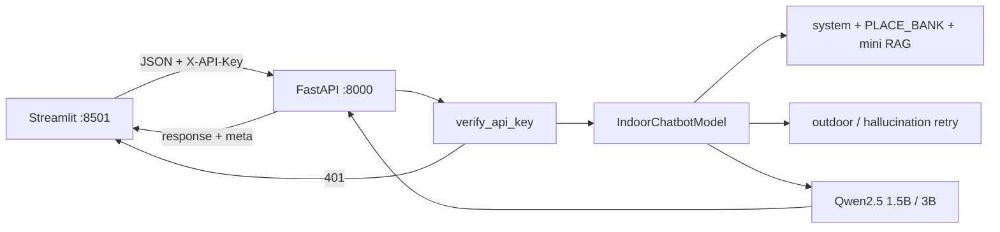
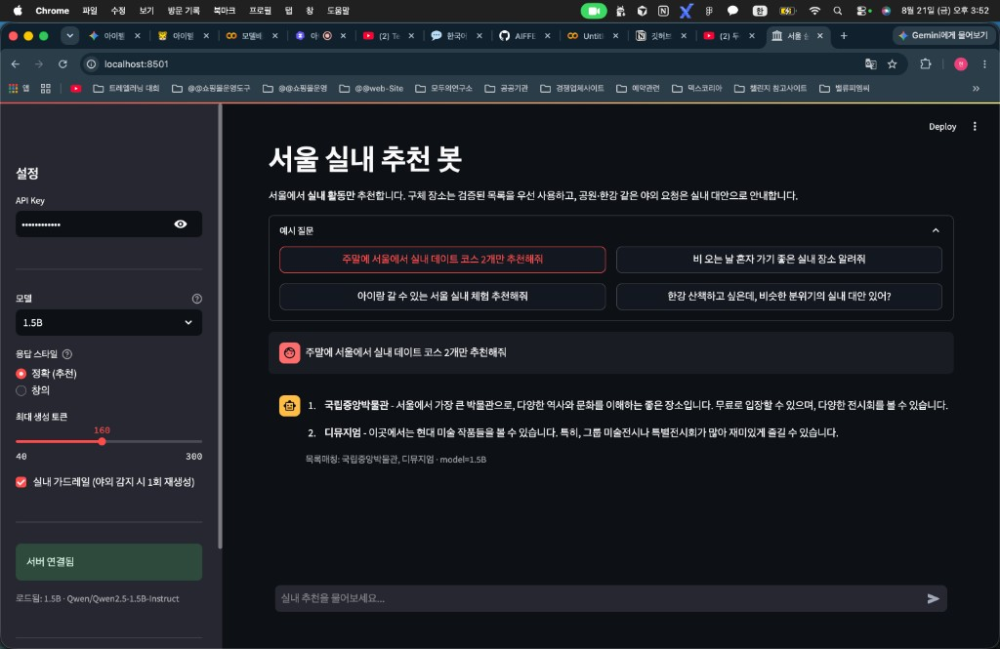
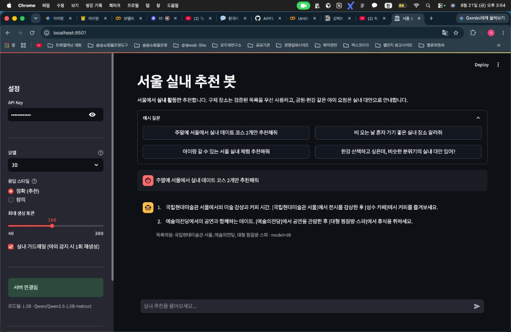
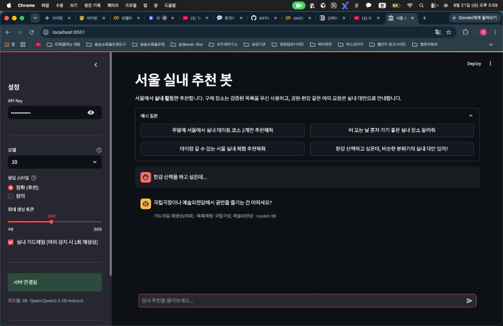
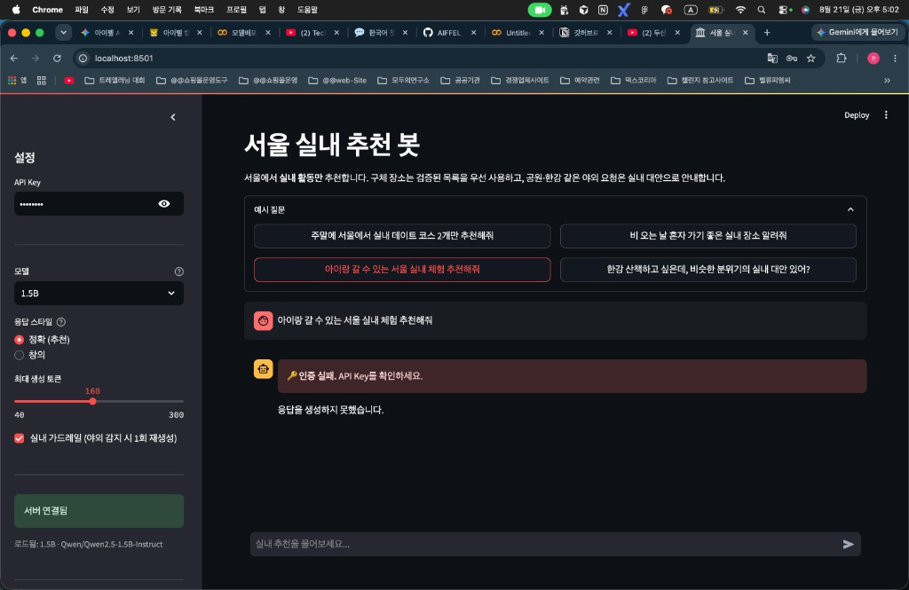
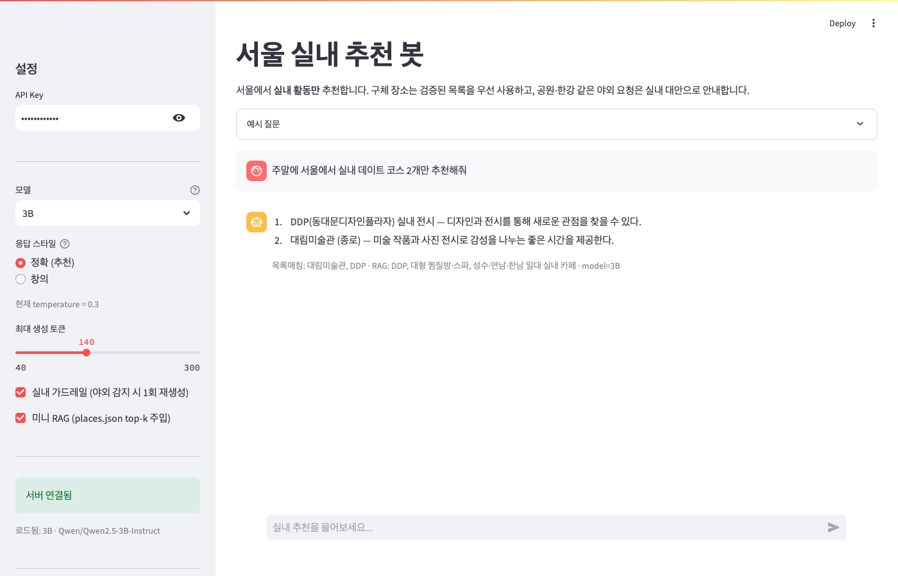

# DP08 — 서울 실내 추천 챗봇 (자율 프로젝트)

- 코더: 최승현
- 과정: AIFFEL Quest ENG / 06_Deployment / DP08
- 기반: Day 1~7 (FastAPI + API Key + Streamlit + Qwen Instruct)
- 주제: **서울 실내(indoors) 활동 추천** 특화 챗봇

> 월요일 LMS 요구사항이 확정되면 이 문서의 제출 섹션을 맞춰 다듬습니다.

---

## 1. 한 줄 소개

일반 잡담 봇이 아니라, **“서울에서 실내만 추천”** 이라는 제약을 제품 요구사항으로 삼은 멀티턴 챗봇입니다.  
시스템 프롬프트 + **검증 장소 목록(PLACE_BANK)** + 야외/환각 휴리스틱 가드레일(1회 재생성) + 1.5B/3B 전환으로 Day7 모델 비교 경험을 서비스에 녹였습니다.

## 2. 아키텍처



## 3. 실행 방법 (Mac)

```bash
cd 06_Deployment/DP08

# DP07 가상환경을 재사용해도 됩니다
# source ../DP07/.venv/bin/activate
# 또는
python3 -m venv .venv && source .venv/bin/activate
pip install -r requirements.txt

# API
uvicorn app.chatbot_api:app --host 0.0.0.0 --port 8000

# 다른 터미널 — UI
streamlit run frontend/app_chatbot.py --server.port 8501
```

학습용 API Key: `test-key-001` / `test-key-002`  
기본 모델: `INDOOR_CHATBOT_MODEL=3B` (가볍게 쓰려면 `1.5B`)

가드레일만 빠른 검증:

```bash
PYTHONPATH=. python scripts/test_guardrails.py
```

### Colab에서 7B로 실내 추천 테스트 (선택)

Mac에서는 7B 생성이 사실상 어렵습니다. Colab T4에서 DP08 프롬프트·가드레일 그대로 비교:

```python
%cd /content/AIFFEL_Quest_ENG
!git pull origin main
%cd 06_Deployment/DP08
!pip install -q transformers accelerate torch sentencepiece
!python scripts/compare_indoor_colab.py --models 7B
```

결과 파일: `assets/indoor_compare_7B_colab.md` (다운로드 후 로컬 `assets/`에 넣으면 됨)

## 4. Day7 대비 달라진 점

| 항목 | DP07 | DP08 |
|------|------|------|
| 페르소나 | 일반 한국어 챗봇 | 서울 실내 추천 봇 |
| 시스템 프롬프트 | 짧은 친절 안내 | 실내 규칙 명시 |
| 가드레일 | 없음 | 야외 키워드 + 의심 상호 감지 → 1회 재생성 |
| 장소 | 자유 생성 | 검증 장소 목록(PLACE_BANK) 우선 |
| 모델 선택 | 서버 고정 | UI에서 1.5B / 3B (기본 **3B**) |
| 응답 메타 | 텍스트만 | `retried`, `retry_reasons`, `place_hits` 등 |
| Temperature 기본 | 0.8 | **0.3** (정확) / 0.9 (창의), 형식 `1) 장소 — 이유`, 무료·영업시간 단정 금지, **max_tokens 기본 140**, 이전 추천 장소 제외 |

### 4.1 장소 환각 줄이기 (추가 실험)

초기 데모에서 1.5B가 `서울 실내 체험관`처럼 **모호·가상 상호**를 만드는 경우가 있었다.  
이를 줄이기 위해 아래 3단을 넣었다.

| 단계 | 내용 | 코드 |
|------|------|------|
| 1. 목록 주입 | 국립중앙박물관, 별마당도서관, 코엑스 아쿠아리움 등 **실제 실내 장소**를 system prompt의 `[추천 가능 장소 목록]`에 넣음. 구체 상호는 목록에서만, 없으면 지역+카테고리만 말하도록 지시 | `app/prompts.py` → `PLACE_BANK`, `SYSTEM_PROMPT` |
| 2. 의심 패턴 재생성 | `서울 실내 체험`, `실내 체험관`, `한컴타워` 등 패턴이 보이면 1회 재생성 | `app/guardrails.py` + `HALLUCINATION_RETRY_INSTRUCTION` |
| 3. UI 메타 | 응답 아래 `목록매칭: …` / `가드레일 재생성(환각)` caption으로 동작 가시화 | `frontend/app_chatbot.py` |

**적용 후 체감:** 같은 “실내 데이트 2개” 질문에서 국립중앙박물관·디뮤지엄·DDP·국립현대미술관 등 **목록에 있는 이름**이 나오고, caption에 `목록매칭`이 표시됨 (시나리오 5.0·5.1 캡처).

**한계:** 목록 밖 사실을 검증하는 대용량 RAG는 아님. 영업시간·“무료” 같은 단정, `DPP` 오타 등은 남을 수 있음.

### 4.2 미니 RAG 골격

벡터 DB 없이 `data/places.json`(이름·지역·태그·한 줄 설명)에서 질문과 관련된 장소를 **top-k** 로 골라 프롬프트 `[검색 컨텍스트]`에 넣습니다.

| 구성 | 경로 |
|------|------|
| 장소 DB | `data/places.json` |
| 검색 | `app/rag.py` (`retrieve`, 키워드·태그 점수) |
| 주입 | `IndoorChatbotModel._build_chat` |
| ON/OFF | UI 체크박스 / `INDOOR_RAG=0` 환경변수 |

검증:

```bash
PYTHONPATH=. python scripts/test_rag.py
```

이후 임베딩 모델로 `retrieve()`만 교체하면 본격 RAG로 확장 가능합니다.

## 5. 데모 시나리오

### 5.0 기본 실내 추천 ✅

질문: `주말에 서울에서 실내 데이트 코스 2개만 추천해줘` (1.5B, 정확, 가드레일 ON)

- 결과: 국립중앙박물관, DDP(동대문디자인플라자) 실내 전시  
- `목록매칭: 국립중앙박물관` — 실내·목록 기반 추천으로 동작 확인  
- 참고: 응답에 `DPP` 오타가 섞일 수 있음(정답은 DDP). 작은 모델의 표기 흔들림.


### 5.1 모델 비교 (같은 질문) ✅

| 모델 | 추천 요약 | 목록매칭 | 체감 |
|------|-----------|----------|------|
| 1.5B | 국립중앙박물관, 디뮤지엄 | ✅ | 실내·목록 준수, 단정 정보는 과한 편(무료 등) |
| 3B | 국립현대미술관 서울+성수 카페, 예술의전당+찜질방 | ✅ | 코스형(보기→쉬기)으로 더 구체적 |





**메모:** 둘 다 PLACE_BANK 덕분에 환각형 상호는 줄었다. 이 질문에서는 **3B가 데이트 코스 구성이 더 자연스러움**.

### 5.2 야외 유도 → 실내 대안 ✅

질문: `한강 산책을 하고 싶은데...` (3B, 정확, 가드레일 ON)

- 결과: 국립극장, 예술의전당 등 **실내 공연** 대안  
- caption: `가드레일 재생성(야외)` · `목록매칭: 국립극장, 예술의전당` · `model=3B`  
- 야외 의도 감지 후 1회 재생성 → 실내·목록 기반 추천으로 전환된 사례



### 5.3 인증 실패 ✅

API Key를 `wrong-key` 등으로 바꾼 뒤 질문 전송.

- UI: `🔑 인증 실패. API Key를 확인하세요.`
- 하단에 `응답을 생성하지 못했습니다.` 표시
- Day6 인증 모듈 재사용이 UI까지 연결된 것을 확인



### 5.4 미니 RAG 데모 ✅

질문: `주말에 서울에서 실내 데이트 코스 2개만 추천해줘` (3B, 정확, 가드레일 ON, **미니 RAG ON**)

- 응답: `1) DDP 실내 전시` / `2) 대림미술관` (형식 준수)
- caption: `목록매칭: 대림미술관, DDP` · `RAG: DDP, 대형 찜질방·스파, 성수·연남·한남 일대 실내 카페` · `model=3B`
- `places.json` top-k가 프롬프트에 주입되고, 최종 추천이 검색·목록과 맞물리는 것을 확인



## 6. 회고

**배운 점**
- 서빙 파이프라인(FastAPI·인증·Streamlit)은 Day1~7을 조립하면 되고, 제품 차이는 **제약(실내)을 프롬프트·가드레일·목록으로 얼마나 강제하느냐**에 있었다.
- 모델이 크다고 항상 좋은 것은 아님(Day7 7B 경험). 다만 같은 PLACE_BANK 아래 **3B가 데이트 코스 구성은 더 자연스러웠다.**
- 환각은 “더 큰 모델”만으로 안 줄고, **검증 목록 + 미니 RAG(검색 컨텍스트)** 가 체감이 컸다.

**아쉬운 점**
- 키워드 RAG는 임베딩 RAG보다 의도 매칭이 거칠 수 있음. 다음 단계는 `retrieve()` 임베딩 교체 또는 지도 링크 연동.
- 사이드바「로드됨」은 채팅 응답의 `model_key`와 `/health`로 동기화한다. 선택 모델과 다르면 “다음 요청 시 교체” 안내를 띄운다.

**실행 환경**
- Mac MPS / 기본 **3B**, 경량 비교·빠른 응답 시 1.5B
- Colab T4는 7B 실험 참고 (`DP07/assets/model_compare_7B_colab.md`)

## 7. 체크리스트

- [x] API `/health`, `/chat` 동작
- [x] Streamlit 예시 질문·모델 전환·가드레일 캡션 확인
- [x] 시나리오: 기본 실내 추천, 1.5B vs 3B 비교 캡처
- [x] 시나리오: 한강(야외→실내) 가드레일 캡처
- [x] 시나리오: 인증 실패 캡처
- [x] 장소 환각 완화(PLACE_BANK) 문서화
- [x] 미니 RAG 골격 + 데모 캡처 (`scenario_rag_demo.png`)
- [ ] (선택) Colab 7B 실내 추천 비교 → `assets/indoor_compare_7B_colab.md`
- [ ] LMS 요구사항 반영 후 최종 다듬기
- [ ] GitHub 푸시 + 제출 링크
