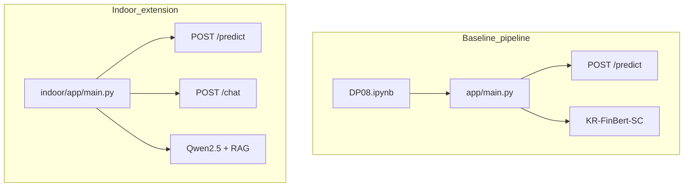
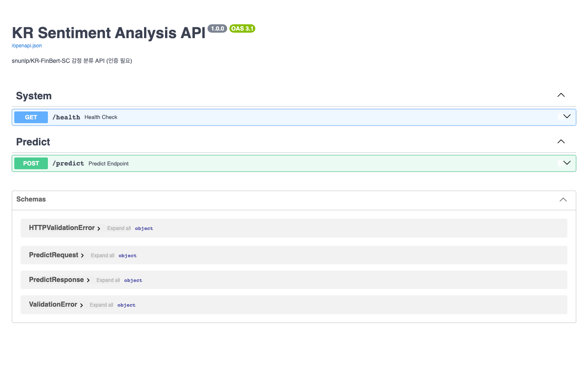
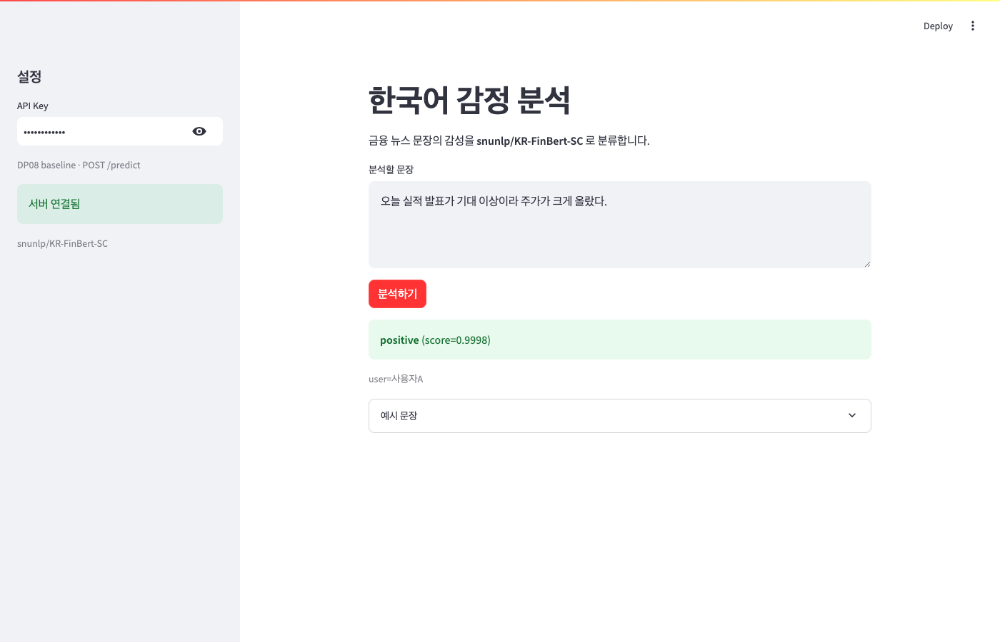
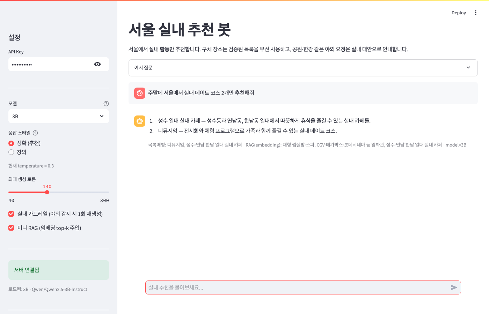
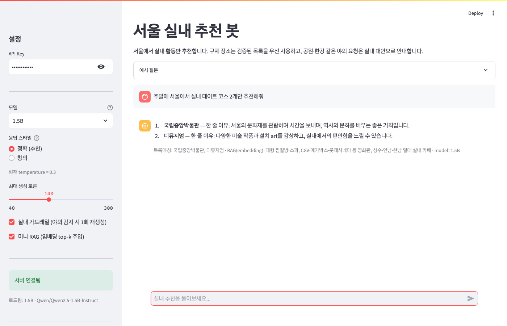
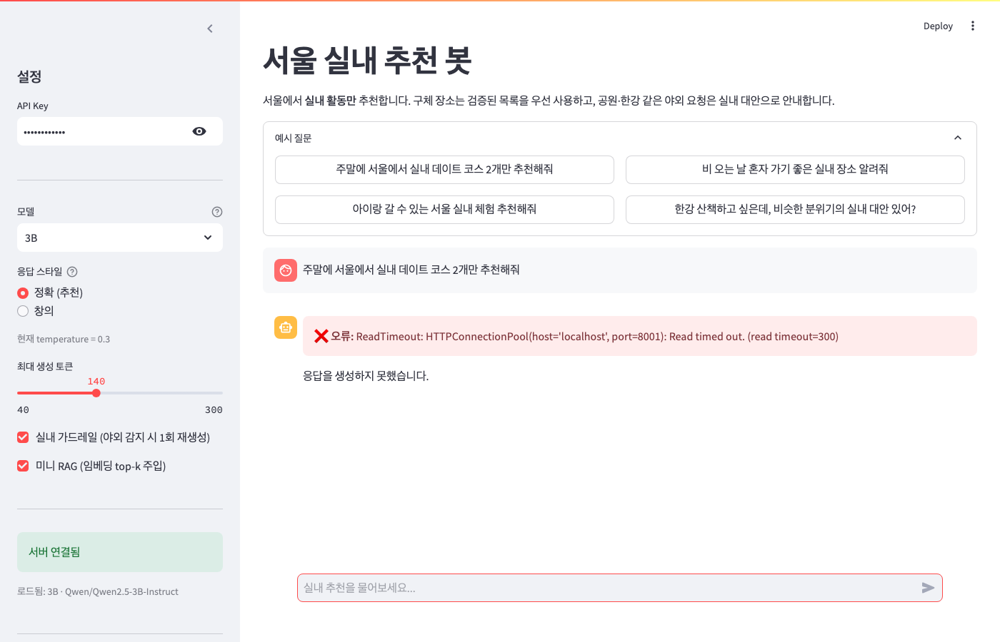
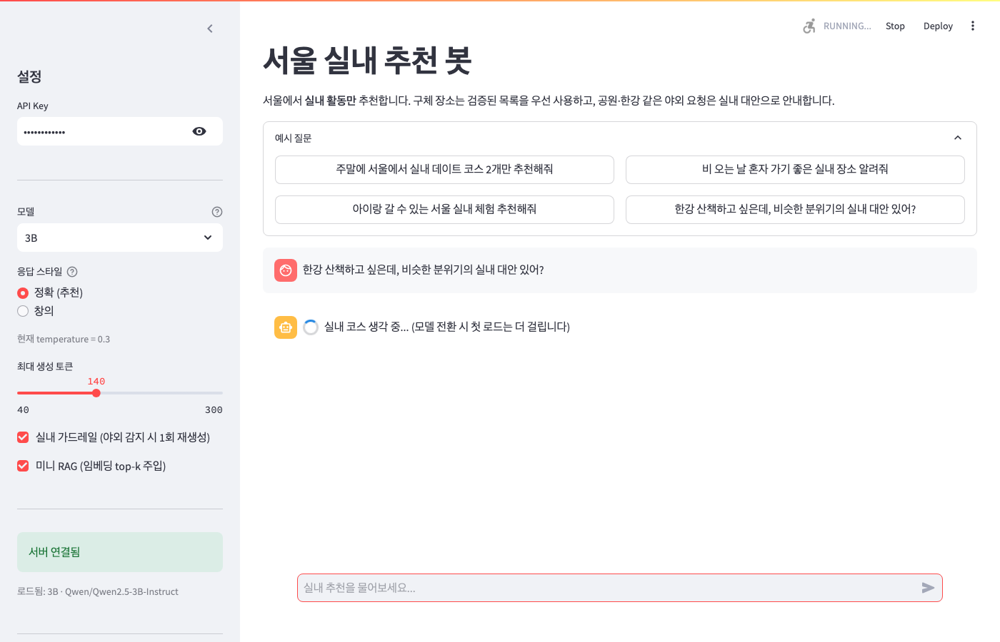
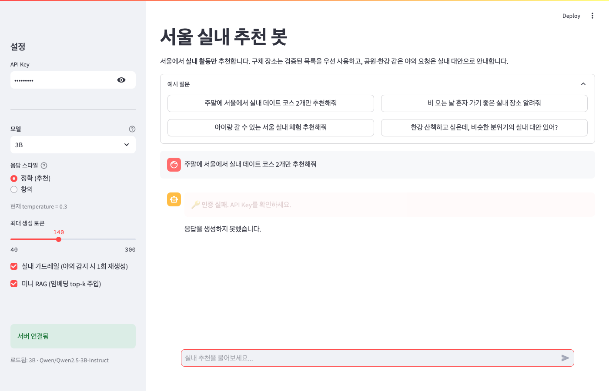

# DP08 — 자율 프로젝트 제출 (06DP08)

- 코더: 최승현
- 과정: AIFFEL Quest ENG / 06_Deployment / DP08
- 교안: [`DP08.ipynb`](../DP08.ipynb)

---

## 0. 프로젝트 구성

공식 노트북 기준 **baseline + 확장** 두 트랙입니다.

| 트랙 | 도메인 | 모델 | 포트 | 경로 |
|------|--------|------|------|------|
| **Baseline (LMS·데모)** | 한국어 감정 분석 | `snunlp/KR-FinBert-SC` | API 8000 / UI 8501 | 루트 `app/`, `frontend/app.py` |
| **Indoor 확장** | 서울 실내 추천 챗봇 | Qwen2.5 1.5B/3B + RAG | API 8001 / UI 8502 | [`indoor/`](../indoor/) |



---

## 1. 실행 방법

### 1.1 Baseline — 감정 분석 (노트북 제출·데모)

```bash
cd 06_Deployment/DP08
source ../DP07/.venv/bin/activate
pip install -r requirements.txt

uvicorn app.main:app --host 0.0.0.0 --port 8000
# 다른 터미널
streamlit run frontend/app.py --server.port 8501
```

- Swagger: http://localhost:8000/docs
- API Key: `test-key-001` / `test-key-002`
- `POST /predict` — `{ "text": "오늘 실적이 좋아 주가가 올랐다." }`

### 1.2 Indoor 확장 — 서울 실내 추천

```bash
cd 06_Deployment/DP08/indoor
pip install -r requirements.txt

uvicorn app.main:app --host 0.0.0.0 --port 8001
# 다른 터미널
streamlit run frontend/app.py --server.port 8502
```

- `POST /predict` — 단일 질문 실내 추천
- `POST /chat` — 멀티턴 + RAG + 가드레일
- 테스트: `PYTHONPATH=. python scripts/test_rag.py`

---

## 2. 실행 캡처와 설명 (제출 ①)

> 캡처 일시: 2026-08-24 · Baseline `:8000`/`:8501` · Indoor `:8001`/`:8502`

### 2.1 Baseline — Pipeline 감정 분석 (LMS 메인)

모델: `snunlp/KR-FinBert-SC` · 엔드포인트: `POST /predict` · API Key: `test-key-001`

| 항목 | 설명 | 캡처 |
|------|------|------|
| Swagger UI | `/docs`에서 Predict API 확인 |  |
| Streamlit 추론 | 문장 입력 → `positive` / score 표시 |  |
| 인증 401 | API Key 없이 `/predict` 호출 |  |

**확인 내용**
- `GET /health` → `status: healthy`, `model: snunlp/KR-FinBert-SC`
- `POST /predict` + Key → `{ "success": true, "label": "positive", "score": ~0.99 }`
- Key 없음 → **401** `API Key가 필요합니다`
- 빈 `text` → **422** (Pydantic `min_length=1`)

### 2.2 Indoor 확장 — 서울 실내 추천 (Day7 발전)

모델: Qwen2.5 **3B**(기본) / 1.5B · RAG: 임베딩 하이브리드 · 가드레일: 야외/환각 1회 재생성

| 시나리오 | 질문·조건 | 설명 | 캡처 |
|----------|-----------|------|------|
| 기본 실내 추천 | 데이트 2개, 3B, RAG ON | PLACE_BANK 목록 기반 추천, caption `목록매칭` |  |
| 1.5B vs 3B | 동일 질문, 모델만 변경 | 1.5B는 단순·3B는 코스형 구성이 더 자연스러움 |  /  |
| 야외→실내 | 한강 산책 유도, 3B | 실내 대안(공연·몰 등)으로 전환, `목록매칭` |  |
| 인증 실패 | API Key `wrong-key` | UI `🔑 인증 실패` 표시 |  |
| 미니 RAG | 데이트 2개, RAG ON | caption `RAG(embedding): …` + 목록매칭 |  |
| Colab 7B | T4 GPU 참고 | Mac 서빙 상한 비교 | [`indoor_compare_7B_colab.md`](../indoor/assets/indoor_compare_7B_colab.md) |

**Indoor 핵심 차별점 (DP07 대비)**
- 실내 전용 system prompt + PLACE_BANK (~48곳, `indoor/data/places.json`)
- 야외/환각 휴리스틱 → 필요 시 1회 재생성
- `retrieve()` 임베딩(MiniLM) + 키워드 하이브리드 RAG
- UI caption: `목록매칭`, `RAG(embedding)`, `model=3B`, `가드레일 재생성(야외)` 등

**재촬영 명령 (참고)**
```bash
cd 06_Deployment/DP08
../DP07/.venv/bin/python scripts/capture_all_demos.py        # 전체
../DP07/.venv/bin/python scripts/capture_indoor_remaining.py # indoor만
```

---

## 3. 체크포인트 Q1~Q5 (제출 ②)

### Q1. Pydantic 검증은 어떤 잘못된 입력을 막아줍니까?

**Baseline (`app/schemas.py`)**
- `text` 빈 문자열 → 422 (min_length=1)
- 512자 초과 → 422 (max_length=512)

**Indoor (`indoor/app/schemas.py`)**
- `messages` 빈 배열 → 422
- `temperature` 0 이하·2 초과 → 422
- `max_new_tokens` 범위 밖 → 422
- `/predict`의 `text` 빈 문자열·2000자 초과 → 422

### Q2. `Depends(verify_api_key)`를 제거하면 어떤 위험이 있습니까?

- 누구나 `/predict`, `/chat`을 호출해 **GPU/CPU 추론 자원을 무단 소모**할 수 있습니다.
- LLM(Indoor)은 요청당 수 초~수십 초로 **비용·지연**이 큽니다.
- API Key로 호출 주체를 구분해 Day6 인증 패턴을 유지했습니다.

### Q3. `run_in_executor`를 사용한 이유는 무엇입니까?

- `transformers` pipeline·LLM `generate()`는 **동기 blocking** 작업입니다.
- FastAPI async 핸들러에서 직접 호출하면 이벤트 루프가 막혀 `/health` 등 다른 요청이 지연됩니다.
- `ThreadPoolExecutor`로 추론을 분리해 **비동기 서버가 응답 가능** 상태를 유지합니다.

### Q4. Day 1~8 중 가장 많이 참고한 Day는 어디였습니까? 왜?

| Day | 참고 내용 |
|-----|-----------|
| **Day 5** | Pydantic 스키마, `/predict` 패턴, housing API 구조 |
| **Day 6** | `auth.py` 재사용, 401 처리 |
| **Day 7** | Indoor 확장 — 멀티턴 챗, Streamlit 채팅 UI |
| **Day 8 노트북** | `main.py` / `schemas.py` / `model_service.py` / `frontend/app.py` 뼈대 |

Baseline은 Day5+6, Indoor 확장은 Day7을 가장 많이 참고했습니다.

### Q5. 이 서비스를 실제로 배포하려면 추가로 무엇이 필요합니까?

- **Docker** 이미지화 + CI/CD (노트북 Next Step)
- **GPU/메모리** 스케일링 (Indoor 3B+, 임베딩 CPU 분리)
- **HTTPS**, Key 로테이션, rate limit
- **로그·모니터링** (요청 수, 지연, 5xx)
- Indoor: places.json **주기적 갱신**, 지도/영업시간 외부 API 또는 RAG 확장
- Colab 7B는 품질 참고용 — Mac 서빙은 **3B + RAG**가 현실적

---

## 4. 회고 (제출 ③)

### Baseline (pipeline)에서 배운 점

- 노트북 `%%writefile` 구조대로 `main → model_service → schemas`를 두면 **교안과 1:1 대응**되어 Swagger 데모·제출이 수월합니다.
- `pipeline("text-classification")`은 CPU에서도 빠르게 동작해 **Day8 평가 기준(서버·Swagger·401·422·Streamlit)** 을 안정적으로 충족합니다.

### Indoor 확장에서 배운 점

- 도메인 특화는 “더 큰 모델”보다 **프롬프트·목록·가드레일·RAG** 조합이 체감 품질을 좌우합니다.
- 7B(Colab)는 형식·실내 제약을 재생성 없이 잘 지켰지만, Mac 서빙은 **3B + 미니 RAG**가 현실적입니다.
- `retrieve()` 임베딩 교체 후 한국어 의도(한강·아이)는 키워드 하이브리드로 보완했습니다.

### 아쉬운 점

- Baseline과 Indoor를 **포트·의존성**으로 분리했지만, 제출물이 두 갈래라 설명 부담이 있습니다.
- Indoor: 영업시간·지도 링크 등 외부 사실 검증은 미구현.

### 다음에 다시 만든다면

- 처음부터 노트북 뼈대(`main.py` 등)로 시작하고, 특화 기능은 `indoor/`처럼 **서브프로젝트**로 확장하겠습니다.

---

## 5. Indoor 기술 상세 (참고)

### 5.1 미니 RAG

| 구성 | 경로 |
|------|------|
| 장소 DB | `indoor/data/places.json` (~48곳) |
| 검색 | `indoor/app/rag.py` (MiniLM + 키워드 하이브리드) |
| 주입 | `IndoorChatbotModel._build_chat` |

### 5.2 Colab 7B (선택)

```bash
cd 06_Deployment/DP08/indoor
PYTHONPATH=. python scripts/compare_indoor_colab.py --models 7B
```

### 5.3 Hugging Face 대체 모델 후보 (재실행 없이 정리)

채택 모델은 **교안 호환·Mac 서빙·이미 검증한 캡처** 기준으로 유지했습니다. 아래는 동일 역할을 할 수 있는 HF 후보를 조사만 해 둔 참고입니다 (추가 추론·재촬영 없음).

#### Baseline — `snunlp/KR-FinBert-SC` 대체

| 모델 | 특징 | 비고 |
|------|------|------|
| [`kwoncho/KoFinBERT`](https://huggingface.co/kwoncho/KoFinBERT) | 기업 뉴스 긍정/중립/부정 | `text-classification` 파이프라인에 넣기 쉬움 |
| [`DataWizardd/finbert-sentiment-ko`](https://huggingface.co/DataWizardd/finbert-sentiment-ko) | 환율·금융 뉴스 요약 특화 | KR-FinBert 계열 파인튜닝 |
| [`FISA-conclave/klue-roberta-news-sentiment`](https://huggingface.co/FISA-conclave/klue-roberta-news-sentiment) | KLUE-RoBERTa 뉴스 기업 감정 | 라벨·입력 스키마가 다를 수 있음 |
| [`amphora/KorFinASC-XLM-RoBERTa`](https://huggingface.co/amphora/KorFinASC-XLM-RoBERTa) | 개체 수준 금융 감정 | 단순 `pipeline`보다 입력이 복잡 |

#### Indoor — Qwen2.5 1.5B / 3B 대체

| 모델 | 특징 | Mac 관점 |
|------|------|----------|
| [`MyeongHo0621/Qwen2.5-3B-Korean`](https://huggingface.co/MyeongHo0621/Qwen2.5-3B-Korean) | 3B급 + 한국어 파인튜닝 | 품질 개선 후보, 메모리 ≈ 현재와 유사 |
| [`kakaocorp/kanana-nano-2.1b-instruct`](https://huggingface.co/kakaocorp/kanana-nano-2.1b-instruct) | 카카오 한·영 ~2.1B | 3B보다 가볍게 시도 가능 |
| [`torchtorchkimtorch/Llama-3.2-Korean-GGACHI-1B-Instruct-v1`](https://huggingface.co/torchtorchkimtorch/Llama-3.2-Korean-GGACHI-1B-Instruct-v1) | 1B 한국어 instruct | 속도·메모리 유리, 품질은 낮을 수 있음 |
| Colab 7B (기존 기록) | 품질 상한 참고 | 로컬 서빙 대상 아님 — [`indoor_compare_7B_colab.md`](../indoor/assets/indoor_compare_7B_colab.md) |

---

## 6. 파일 맵

| Baseline (루트) | Indoor 확장 |
|-----------------|-------------|
| `app/main.py` | `indoor/app/main.py` |
| `app/schemas.py` | `indoor/app/schemas.py` |
| `app/model_service.py` | `indoor/app/model_service.py` |
| `app/auth.py` | `indoor/app/auth.py` |
| `frontend/app.py` | `indoor/frontend/app.py` |
